# Skill graph

Generated by `tools/skill_graph.py` from every skill.json. Do not edit by hand.

```mermaid
graph TD
    agentic-stack --> build-adapter-pair
    agentic-stack --> build-ceremony
    agentic-stack --> build-definition-of-done
    agentic-stack --> build-evidence-record
    agentic-stack --> build-interface-versioning
    build-adapter-pair --> build-interface-versioning
    build-ceremony --> build-interface-versioning
    build-definition-of-done --> build-interface-versioning
    build-research-record --> build-interface-versioning
    build-skill-authoring --> build-interface-versioning
    agentic-stack --> build-research-record
    agentic-stack --> build-simplicity-budget
    build-ceremony --> build-simplicity-budget
    build-definition-of-done --> build-simplicity-budget
    build-research-record --> build-simplicity-budget
    build-skill-authoring --> build-simplicity-budget
    agentic-stack --> build-skill-authoring
    agentic-stack --> cap-agent-runtime
    build-adapter-pair --> cap-agent-runtime
    build-definition-of-done --> cap-agent-runtime
    build-skill-authoring --> cap-agent-runtime
    cap-errors --> cap-agent-runtime
    build-adapter-pair --> cap-agent-runtime-implement
    build-definition-of-done --> cap-agent-runtime-implement
    build-evidence-record --> cap-agent-runtime-implement
    cap-agent-runtime --> cap-agent-runtime-implement
    cap-agent-runtime --> cap-agent-runtime-use
    cap-agent-runtime-implement --> cap-agent-runtime-use
    agentic-stack --> cap-capability-packaging
    build-adapter-pair --> cap-capability-packaging
    build-definition-of-done --> cap-capability-packaging
    build-skill-authoring --> cap-capability-packaging
    cap-document-validation --> cap-capability-packaging
    cap-errors --> cap-capability-packaging
    build-adapter-pair --> cap-capability-packaging-implement
    build-definition-of-done --> cap-capability-packaging-implement
    build-evidence-record --> cap-capability-packaging-implement
    cap-capability-packaging --> cap-capability-packaging-implement
    cap-capability-packaging --> cap-capability-packaging-use
    cap-capability-packaging-implement --> cap-capability-packaging-use
    agentic-stack --> cap-document-validation
    build-adapter-pair --> cap-document-validation
    build-definition-of-done --> cap-document-validation
    build-skill-authoring --> cap-document-validation
    build-adapter-pair --> cap-document-validation-implement
    build-definition-of-done --> cap-document-validation-implement
    build-evidence-record --> cap-document-validation-implement
    cap-document-validation --> cap-document-validation-implement
    cap-document-validation --> cap-document-validation-use
    cap-document-validation-implement --> cap-document-validation-use
    agentic-stack --> cap-durable-execution
    build-adapter-pair --> cap-durable-execution
    build-definition-of-done --> cap-durable-execution
    build-skill-authoring --> cap-durable-execution
    cap-errors --> cap-durable-execution
    build-adapter-pair --> cap-durable-execution-implement
    build-definition-of-done --> cap-durable-execution-implement
    build-evidence-record --> cap-durable-execution-implement
    cap-durable-execution --> cap-durable-execution-implement
    cap-durable-execution --> cap-durable-execution-use
    cap-durable-execution-implement --> cap-durable-execution-use
    agentic-stack --> cap-errors
    build-adapter-pair --> cap-errors
    build-definition-of-done --> cap-errors
    build-skill-authoring --> cap-errors
    build-adapter-pair --> cap-errors-implement
    build-definition-of-done --> cap-errors-implement
    build-evidence-record --> cap-errors-implement
    cap-errors --> cap-errors-implement
    cap-errors --> cap-errors-use
    cap-errors-implement --> cap-errors-use
    agentic-stack --> cap-idempotency
    build-adapter-pair --> cap-idempotency
    build-definition-of-done --> cap-idempotency
    build-skill-authoring --> cap-idempotency
    cap-errors --> cap-idempotency
    build-adapter-pair --> cap-idempotency-implement
    build-definition-of-done --> cap-idempotency-implement
    build-evidence-record --> cap-idempotency-implement
    cap-idempotency --> cap-idempotency-implement
    cap-idempotency --> cap-idempotency-use
    cap-idempotency-implement --> cap-idempotency-use
    agentic-stack --> cap-identity
    build-adapter-pair --> cap-identity
    build-definition-of-done --> cap-identity
    build-skill-authoring --> cap-identity
    cap-errors --> cap-identity
    build-adapter-pair --> cap-identity-implement
    build-definition-of-done --> cap-identity-implement
    build-evidence-record --> cap-identity-implement
    cap-identity --> cap-identity-implement
    cap-identity --> cap-identity-use
    cap-identity-implement --> cap-identity-use
    agentic-stack --> cap-isolation
    build-adapter-pair --> cap-isolation
    build-definition-of-done --> cap-isolation
    build-skill-authoring --> cap-isolation
    cap-errors --> cap-isolation
    build-adapter-pair --> cap-isolation-implement
    build-definition-of-done --> cap-isolation-implement
    build-evidence-record --> cap-isolation-implement
    cap-isolation --> cap-isolation-implement
    cap-isolation --> cap-isolation-use
    cap-isolation-implement --> cap-isolation-use
    agentic-stack --> cap-model-access
    build-adapter-pair --> cap-model-access
    build-definition-of-done --> cap-model-access
    build-skill-authoring --> cap-model-access
    cap-errors --> cap-model-access
    build-adapter-pair --> cap-model-access-implement
    build-definition-of-done --> cap-model-access-implement
    build-evidence-record --> cap-model-access-implement
    cap-model-access --> cap-model-access-implement
    cap-model-access --> cap-model-access-use
    cap-model-access-implement --> cap-model-access-use
    agentic-stack --> cap-policy
    build-adapter-pair --> cap-policy
    build-definition-of-done --> cap-policy
    build-skill-authoring --> cap-policy
    cap-document-validation --> cap-policy
    cap-errors --> cap-policy
    build-adapter-pair --> cap-policy-implement
    build-definition-of-done --> cap-policy-implement
    build-evidence-record --> cap-policy-implement
    cap-policy --> cap-policy-implement
    cap-policy --> cap-policy-use
    cap-policy-implement --> cap-policy-use
    agentic-stack --> cap-provenance
    build-adapter-pair --> cap-provenance
    build-definition-of-done --> cap-provenance
    build-evidence-record --> cap-provenance
    build-skill-authoring --> cap-provenance
    cap-errors --> cap-provenance
    build-adapter-pair --> cap-provenance-implement
    build-definition-of-done --> cap-provenance-implement
    build-evidence-record --> cap-provenance-implement
    cap-provenance --> cap-provenance-implement
    cap-provenance --> cap-provenance-use
    cap-provenance-implement --> cap-provenance-use
    agentic-stack --> cap-scheduling
    build-adapter-pair --> cap-scheduling
    build-definition-of-done --> cap-scheduling
    build-skill-authoring --> cap-scheduling
    cap-errors --> cap-scheduling
    build-adapter-pair --> cap-scheduling-implement
    build-definition-of-done --> cap-scheduling-implement
    build-evidence-record --> cap-scheduling-implement
    cap-scheduling --> cap-scheduling-implement
    cap-scheduling --> cap-scheduling-use
    cap-scheduling-implement --> cap-scheduling-use
```

## Root

| Skill | Builds on | Used by | Purpose |
|---|---|---|---|
| `agentic-stack` | - | - | Root contract for building the agentic platform in PASS.md |

## Capabilities

| Skill | Builds on | Used by | Purpose |
|---|---|---|---|
| `cap-agent-runtime` | `agentic-stack`, `build-adapter-pair`, `build-definition-of-done`, `build-skill-authoring`, `cap-errors` | `cap-agent-runtime-implement`, `cap-agent-runtime-use` | The ideal state of the Agent runtime capability: one prompt turn with a stop reason as the unit of agent execution, governed by the Agent Client Protocol, with the operations the core imports, the turn shapes, what the boundary refuses to expose, and the criteria that decide whether a candidate runtime may serve the interface |
| `cap-agent-runtime-implement` | `build-adapter-pair`, `build-definition-of-done`, `build-evidence-record`, `cap-agent-runtime` | `cap-agent-runtime-use` | How to build the Agent runtime capability on this stack: an interactive adapter over the runtime that already runs, a second adapter that has no session at all, how to migrate execution paths that today share no contract, where the budget, policy, identity, telemetry, provenance and idempotency guarantees attach to a turn, and a definition of done with the breakage that makes it fail |
| `cap-agent-runtime-use` | `cap-agent-runtime`, `cap-agent-runtime-implement` | - | How to run one agent turn and read what came back: the three fields you supply, the one field you branch on, two worked turns, what a failure looks like, and why swapping the thing that runs the agent changes nothing you wrote |
| `cap-capability-packaging` | `agentic-stack`, `build-adapter-pair`, `build-definition-of-done`, `build-skill-authoring`, `cap-document-validation`, `cap-errors` | `cap-capability-packaging-implement`, `cap-capability-packaging-use` | The capability-packaging contract: one portable directory shape any conformant runtime can discover, two required resident fields, three load tiers, and the criteria that decide whether a candidate loader or registry may serve |
| `cap-capability-packaging-implement` | `build-adapter-pair`, `build-definition-of-done`, `build-evidence-record`, `cap-capability-packaging` | `cap-capability-packaging-use` | How to build capability packaging on this stack: the filesystem adapter that runs today, a registry adapter that changes where the bytes come from and what identity means, the migration off directories that are rendered and checked in place, where a package resolution is wired so the platform's guarantees ride on it, and the conformance run that decides whether either source may serve |
| `cap-capability-packaging-use` | `cap-capability-packaging`, `cap-capability-packaging-implement` | - | How to publish and use a packaged capability without knowing how packages are stored: one directory and two fields to publish, one identity to consume, one outcome to read |
| `cap-document-validation` | `agentic-stack`, `build-adapter-pair`, `build-definition-of-done`, `build-skill-authoring` | `cap-capability-packaging`, `cap-document-validation-implement`, `cap-document-validation-use`, `cap-policy` | The document-validation capability: one contract for checking a declared shape against a published schema dialect, JSON Schema 2020-12, with the operations the core imports, the outcome shape, and the criteria that decide whether a candidate validator is good enough |
| `cap-document-validation-implement` | `build-adapter-pair`, `build-definition-of-done`, `build-evidence-record`, `cap-document-validation` | `cap-document-validation-use` | How to build the document-validation capability on this stack: the adapter that runs today, a second adapter whose execution model differs, the migration off the keyword-subset checks that run now, where validation is wired so no caller can decline it, and the conformance run that decides whether either adapter may serve |
| `cap-document-validation-use` | `cap-document-validation`, `cap-document-validation-implement` | - | How to use document validation as a caller: send the document and the name of the shape it claims to be, get back admitted or a located list of everything wrong |
| `cap-durable-execution` | `agentic-stack`, `build-adapter-pair`, `build-definition-of-done`, `build-skill-authoring`, `cap-errors` | `cap-durable-execution-implement`, `cap-durable-execution-use` | The ideal state of the Durable execution capability: a multi-step unit of work survives a crash and resumes at the first incomplete step, expressed as step, idempotency key, checkpoint and resume point and nothing more |
| `cap-durable-execution-implement` | `build-adapter-pair`, `build-definition-of-done`, `build-evidence-record`, `cap-durable-execution` | `cap-durable-execution-use` | How to build the Durable execution capability on this stack: a thin adapter over the external workflow orchestrator that is installed but not listening, a second adapter that has no server at all, how to bring workflows that checkpoint nothing today in front of one interface, where budget, policy, identity, telemetry, provenance and idempotency attach to a step and to a restart, and a definition of done with the crash that makes it fail |
| `cap-durable-execution-use` | `cap-durable-execution`, `cap-durable-execution-implement` | - | How to run a multi-step piece of work that survives a crash: the two things you supply, the one thing you read, two worked runs, what a failure looks like, and why you never write the resume logic yourself |
| `cap-errors` | `agentic-stack`, `build-adapter-pair`, `build-definition-of-done`, `build-skill-authoring` | `cap-agent-runtime`, `cap-capability-packaging`, `cap-durable-execution`, `cap-errors-implement`, `cap-errors-use`, `cap-idempotency`, `cap-identity`, `cap-isolation`, `cap-model-access`, `cap-policy`, `cap-provenance`, `cap-scheduling` | The ideal state of the Errors capability: one typed, machine-readable failure object for every boundary in the platform, governed by RFC 9457 problem details and a closed registry of problem types |
| `cap-errors-implement` | `build-adapter-pair`, `build-definition-of-done`, `build-evidence-record`, `cap-errors` | `cap-errors-use` | How to build the Errors capability on this stack: the first adapter, a second one with a different execution model, what to do when there is nothing to migrate from, how the budget, policy, identity, idempotency and correlation guarantees land in a failure body, and a definition of done with the breakage that makes it fail |
| `cap-errors-use` | `cap-errors`, `cap-errors-implement` | - | How to consume failures from this platform: the three members you actually branch on, what a human, an agent and an event each get back, two worked failures, and why adding a new failure type or swapping the component that produces it does not change code you already wrote |
| `cap-idempotency` | `agentic-stack`, `build-adapter-pair`, `build-definition-of-done`, `build-skill-authoring`, `cap-errors` | `cap-idempotency-implement`, `cap-idempotency-use` | The ideal state of the Idempotency capability: one claim over a key and a payload digest that turns a repeated externally-triggered request into one execution and one answer, governed by the idempotency-key convention and by lease semantics this platform specifies itself |
| `cap-idempotency-implement` | `build-adapter-pair`, `build-definition-of-done`, `build-evidence-record`, `cap-idempotency` | `cap-idempotency-use` | How to build the Idempotency capability on this stack: what the key on the wire already gives you and what it does not, a first enforcing adapter that folds the append-only log at entry, a second with a different execution model that takes a conditional-write lease before execution, the migration between them, where the claim is wired so no entry can skip it, and a definition of done with the breakage that makes it fail |
| `cap-idempotency-use` | `cap-idempotency`, `cap-idempotency-implement` | - | How to use the Idempotency capability as a caller: put one field on what you send, send it again as often as you like, and get one execution and one answer back |
| `cap-identity` | `agentic-stack`, `build-adapter-pair`, `build-definition-of-done`, `build-skill-authoring`, `cap-errors` | `cap-identity-implement`, `cap-identity-use` | The ideal state of the Identity capability: every action names an actor, delegated agent actors included, and the chain that produced the right to act is explicit rather than reconstructed afterwards |
| `cap-identity-implement` | `build-adapter-pair`, `build-definition-of-done`, `build-evidence-record`, `cap-identity` | `cap-identity-use` | How to build the Identity capability on this stack from a starting point of nothing: a first adapter that issues exchanged tokens at each hop, a second whose execution model is the opposite of it, attesting units from platform facts and verifying against distributed trust material with no authority call per action, the order to migrate in, where issuance and verification are wired so no entry can skip them, and a definition of done with the breakage that makes it fail |
| `cap-identity-use` | `cap-identity`, `cap-identity-implement` | - | How to use the Identity capability as a caller: name yourself once on what you send, and every hop after that is added for you |
| `cap-isolation` | `agentic-stack`, `build-adapter-pair`, `build-definition-of-done`, `build-skill-authoring`, `cap-errors` | `cap-isolation-implement`, `cap-isolation-use` | The ideal state of the Isolation capability: one unit of work runs with declared resources and declared egress, governed by the OCI Runtime Spec, with the operations the core imports, the declaration and containment-report shapes, what the boundary refuses to expose, and the criteria that decide whether a containment technology may serve the interface |
| `cap-isolation-implement` | `build-adapter-pair`, `build-definition-of-done`, `build-evidence-record`, `cap-isolation` | `cap-isolation-use` | How to build the Isolation capability on this stack: today's adapter over the per-agent microVM service that already runs, a second adapter that grants capabilities instead of a machine, how the two existing unit shapes become two profiles behind one declaration, where budget, policy, identity, telemetry and provenance attach around a unit rather than inside it, and a definition of done with the breakage that makes it fail |
| `cap-isolation-use` | `cap-isolation`, `cap-isolation-implement` | - | How to run one piece of work contained and read what came back: the one field you supply, the three you read, two worked units, what a refusal looks like, and why changing what contains the work changes nothing you wrote |
| `cap-model-access` | `agentic-stack`, `build-adapter-pair`, `build-definition-of-done`, `build-skill-authoring`, `cap-errors` | `cap-model-access-implement`, `cap-model-access-use` | The ideal state of the Model access capability: one contract for obtaining a completion from a class of model, with no vendor named by the caller and no way to tell whether the answer came back in a second or overnight |
| `cap-model-access-implement` | `build-adapter-pair`, `build-definition-of-done`, `build-evidence-record`, `cap-model-access` | `cap-model-access-use` | How to build the Model access capability on this stack: a thin adapter over the model gateway that already runs on the host, a second adapter that answers hours later with a ticket instead of a result, how to bring the model classes that exist today in front of one interface, where budget, policy, identity, telemetry, provenance and idempotency attach to a submission and again to a claim hours later, and a definition of done with the breakage that makes it fail |
| `cap-model-access-use` | `cap-model-access`, `cap-model-access-implement` | - | How to get an answer out of a model: the two things you send, the one thing you read, two worked calls, what a failure looks like, and why you never name a provider |
| `cap-policy` | `agentic-stack`, `build-adapter-pair`, `build-definition-of-done`, `build-skill-authoring`, `cap-document-validation`, `cap-errors` | `cap-policy-implement`, `cap-policy-use` | The ideal state of the Policy capability: one decision API that takes a structured request and returns a deterministic allow or deny together with the rule that decided it, before anything is spent |
| `cap-policy-implement` | `build-adapter-pair`, `build-definition-of-done`, `build-evidence-record`, `cap-policy` | `cap-policy-use` | How to build the Policy capability on this stack: what the rule sets that exist today already give you and what they do not, a first enforcing adapter that wraps the engine already provisioned behind one decide call, a second with a different execution model that evaluates in process against a typed entity model, the migration between them, where the call is wired so no path can skip it, and a definition of done with the breakage that makes it fail |
| `cap-policy-use` | `cap-policy`, `cap-policy-implement` | - | How to use the Policy capability as a caller: send exactly what you already send, and either the work happens or you get one typed refusal back before anything was spent |
| `cap-provenance` | `agentic-stack`, `build-adapter-pair`, `build-definition-of-done`, `build-evidence-record`, `build-skill-authoring`, `cap-errors` | `cap-provenance-implement`, `cap-provenance-use` | The ideal state of the Provenance capability: a signed statement binding an artifact to the code version, inputs and actor that produced it, in a format a verifier we did not write can check standing alone |
| `cap-provenance-implement` | `build-adapter-pair`, `build-definition-of-done`, `build-evidence-record`, `cap-provenance` | `cap-provenance-use` | How to build the Provenance capability on this stack: what the append-only evidence records and the hash-chained store already give you and what they do not, a first adapter that wraps an existing record in a signed envelope with a held key, a second with a different execution model that signs with an ephemeral identity and publishes to a public append-only log, the migration between them, where the attest call is wired so no output can skip it, and a definition of done with the breakage that makes it fail |
| `cap-provenance-use` | `cap-provenance`, `cap-provenance-implement` | - | How to use the Provenance capability as a caller: send what you were going to send, get back a result that carries a subject digest and a reference to a signed statement about it, and hand that statement to any verifier you trust |
| `cap-scheduling` | `agentic-stack`, `build-adapter-pair`, `build-definition-of-done`, `build-skill-authoring`, `cap-errors` | `cap-scheduling-implement`, `cap-scheduling-use` | The ideal state of the Scheduling capability: computing when a recurring unit of work is due as a pure function of one recurrence rule, a time zone and a window, governed by RFC 5545 recurrence rules, with the firing occurrence entering the platform through the same envelope as every other entry |
| `cap-scheduling-implement` | `build-adapter-pair`, `build-definition-of-done`, `build-evidence-record`, `cap-scheduling` | `cap-scheduling-use` | How to build the Scheduling capability on this stack: what today's engine-owned schedules give you and what they cost, a standalone recurrence evaluator that computes occurrences as a pure call and enqueues them, the migration between the two with the declaration held still, where firing is wired so an occurrence cannot bypass identity, correlation, budget or replay safety, and a definition of done with the breakage that makes it fail |
| `cap-scheduling-use` | `cap-scheduling`, `cap-scheduling-implement` | - | How to use the Scheduling capability as a caller: write one recurrence string and a time zone on the unit of work, add a typed input schema beside it if a person should also be able to start it now, and stop writing timer code |

## Build disciplines

| Skill | Builds on | Used by | Purpose |
|---|---|---|---|
| `build-adapter-pair` | `agentic-stack` | `build-interface-versioning`, `cap-agent-runtime`, `cap-agent-runtime-implement`, `cap-capability-packaging`, `cap-capability-packaging-implement`, `cap-document-validation`, `cap-document-validation-implement`, `cap-durable-execution`, `cap-durable-execution-implement`, `cap-errors`, `cap-errors-implement`, `cap-idempotency`, `cap-idempotency-implement`, `cap-identity`, `cap-identity-implement`, `cap-isolation`, `cap-isolation-implement`, `cap-model-access`, `cap-model-access-implement`, `cap-policy`, `cap-policy-implement`, `cap-provenance`, `cap-provenance-implement`, `cap-scheduling`, `cap-scheduling-implement` | The discipline of shipping two adapters behind one capability interface, where the second is chosen because it breaks a different assumption than the first |
| `build-ceremony` | `agentic-stack` | `build-interface-versioning`, `build-simplicity-budget` | The discipline of closing a section with a ceremony: a review record of findings against what the section produced, then an improve record that marks every finding applied or declined with the files it touched, then continuing |
| `build-definition-of-done` | `agentic-stack` | `build-interface-versioning`, `build-simplicity-budget`, `cap-agent-runtime`, `cap-agent-runtime-implement`, `cap-capability-packaging`, `cap-capability-packaging-implement`, `cap-document-validation`, `cap-document-validation-implement`, `cap-durable-execution`, `cap-durable-execution-implement`, `cap-errors`, `cap-errors-implement`, `cap-idempotency`, `cap-idempotency-implement`, `cap-identity`, `cap-identity-implement`, `cap-isolation`, `cap-isolation-implement`, `cap-model-access`, `cap-model-access-implement`, `cap-policy`, `cap-policy-implement`, `cap-provenance`, `cap-provenance-implement`, `cap-scheduling`, `cap-scheduling-implement` | The discipline that gives every piece a machine-checkable criterion, a deliberate breakage that makes that criterion fail, and the recorded output of both runs |
| `build-evidence-record` | `agentic-stack` | `cap-agent-runtime-implement`, `cap-capability-packaging-implement`, `cap-document-validation-implement`, `cap-durable-execution-implement`, `cap-errors-implement`, `cap-idempotency-implement`, `cap-identity-implement`, `cap-isolation-implement`, `cap-model-access-implement`, `cap-policy-implement`, `cap-provenance`, `cap-provenance-implement`, `cap-scheduling-implement` | The discipline of recording claimed versus measured evidence, so a reader can tell what was observed from what was believed |
| `build-interface-versioning` | `agentic-stack`, `build-adapter-pair`, `build-ceremony`, `build-definition-of-done`, `build-research-record`, `build-skill-authoring` | - | The discipline of versioning a capability interface: every call declares the interface version it speaks, an unsupported version is refused on that call rather than agreed once at connect time, a core field set is frozen as never-changing, and every deprecation carries a stated window |
| `build-research-record` | `agentic-stack` | `build-interface-versioning`, `build-simplicity-budget` | The discipline of keeping one record per search, source and quote, so a claim a skill makes can be traced back to text that was actually read |
| `build-simplicity-budget` | `agentic-stack`, `build-ceremony`, `build-definition-of-done`, `build-research-record`, `build-skill-authoring` | - | Hold every element to a counted simplicity budget: one call or one declaration for the common case, options additive with defaults, and an escape hatch that hands full control back |
| `build-skill-authoring` | `agentic-stack` | `build-interface-versioning`, `build-simplicity-budget`, `cap-agent-runtime`, `cap-capability-packaging`, `cap-document-validation`, `cap-durable-execution`, `cap-errors`, `cap-idempotency`, `cap-identity`, `cap-isolation`, `cap-model-access`, `cap-policy`, `cap-provenance`, `cap-scheduling` | How to author a skill in this repository as data rather than prose: a skill.json conforming to schemas/skill.schema.json, rendered to SKILL.md, with every statement either cited to knowledge-base ids and anchored by a verbatim quote, or marked proposed |

