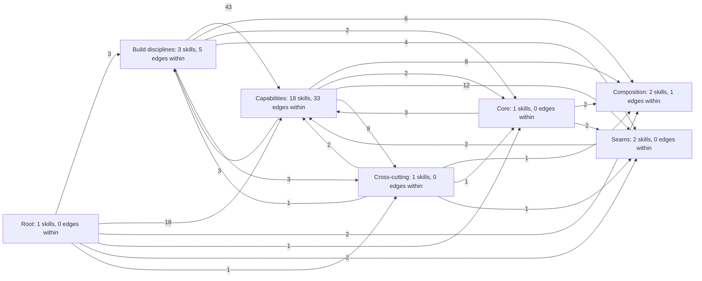
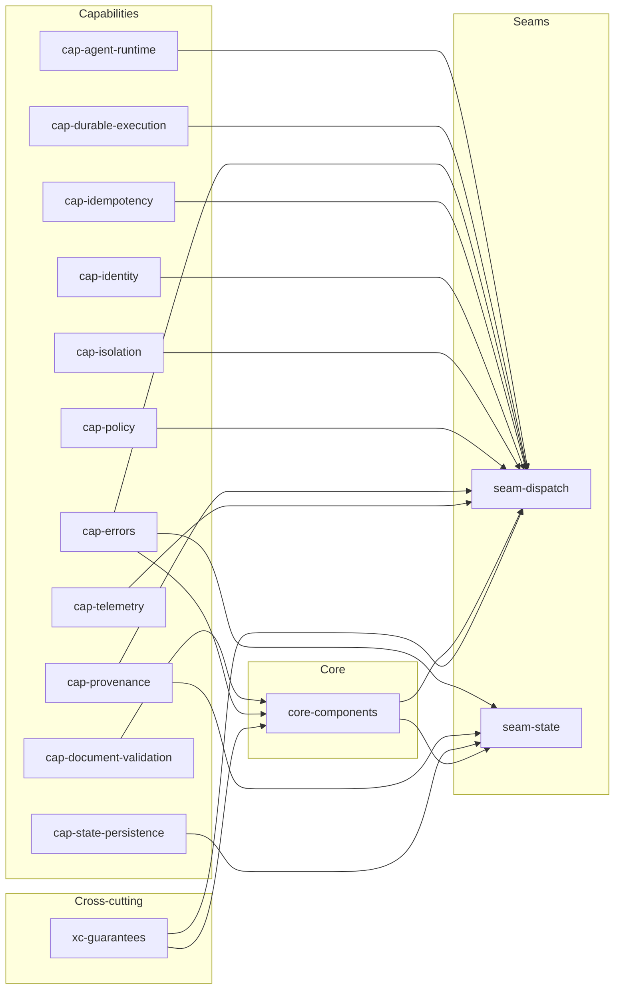
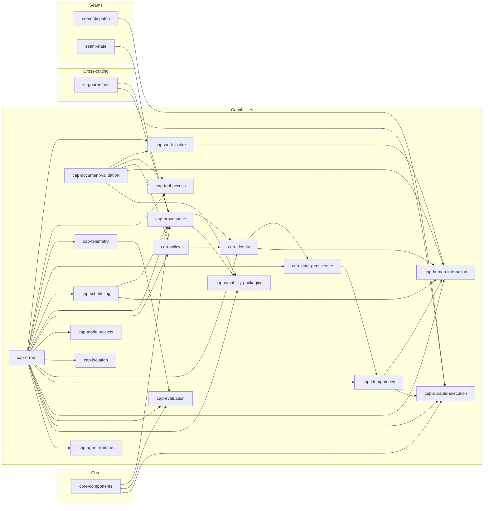
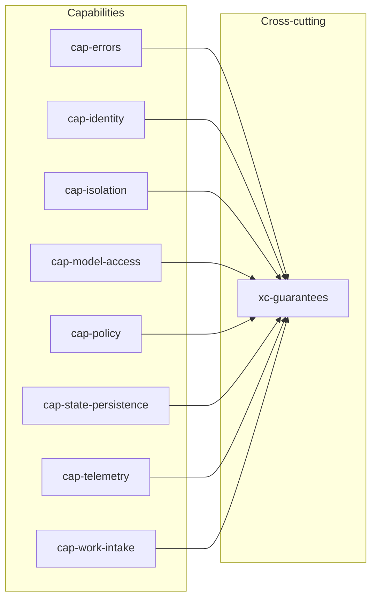
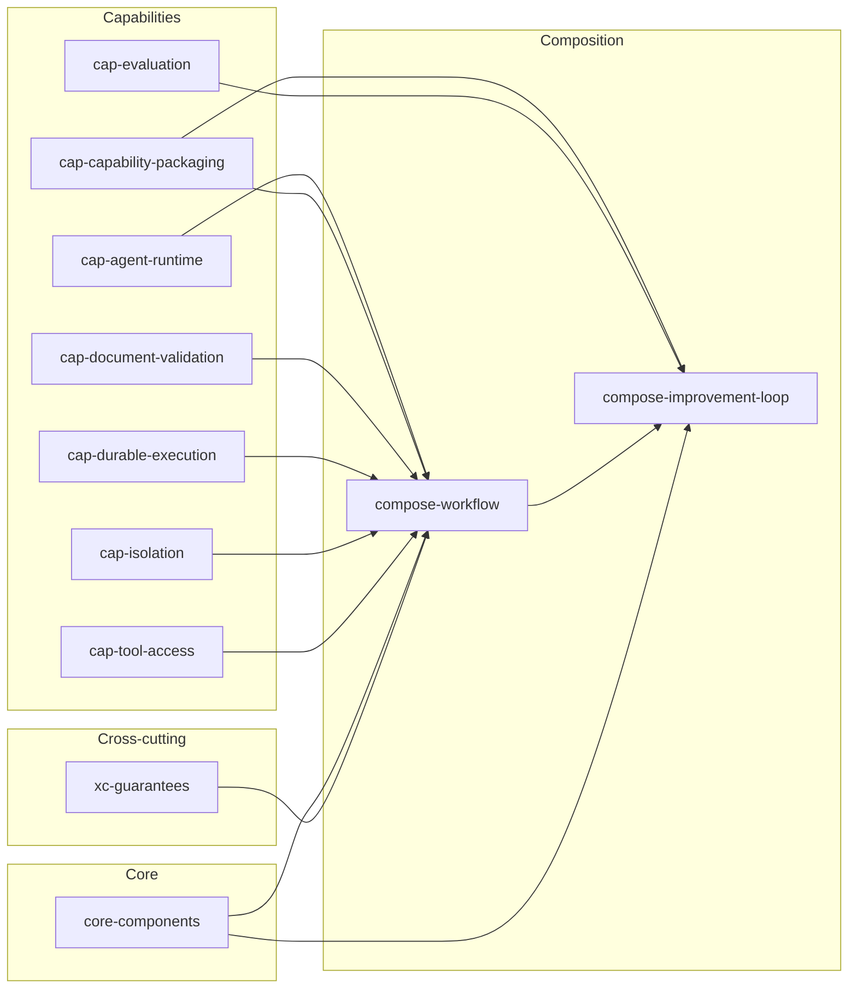
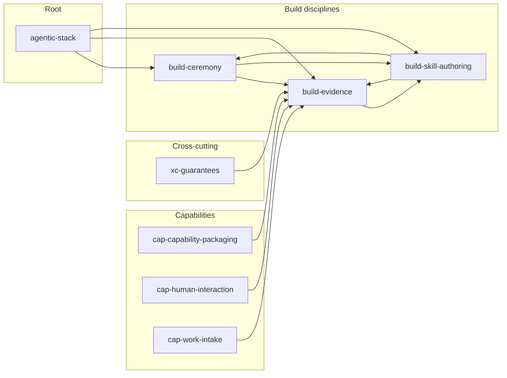
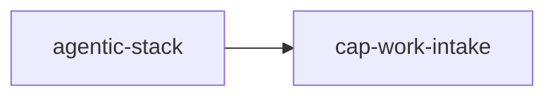

# Skill graph

Generated by `tools/skill_graph.py` from every skill.json. Do not edit by hand.

28 skills, 172 builds_on edges. One diagram of every edge exceeds the mermaid edge budget (500, X-skill-graph-001; text budget 50000 characters, X-skill-graph-002), so the graph is split into focal groups. Each group states its edge count against that budget. Every edge appears in the per-layer tables at the end.

## Overview by layer

Node labels carry the skill count per layer and the edges that stay inside it; edge labels carry how many builds_on edges run from one layer to the other. Build disciplines and the root reach almost every skill, which is why they are kept out of the focal groups below.

25 edges, 932 characters, within the mermaid defaults.

## Core and seams

What the five core components and the two seams build on. An `-implement` facet is folded into its ideal; the build disciplines and the root are omitted here and shown in their own group.

18 edges, 1185 characters, within the mermaid defaults.

## Capabilities

What each capability interface builds on. Same folding and omissions as above.

40 edges, 2314 characters, within the mermaid defaults.

## Cross-cutting concerns

What each cross-cutting concern builds on: the capability it places, and the concerns it chains with.

8 edges, 590 characters, within the mermaid defaults.

## Composition

What each composition assembles. A composition introduces no new interface, so its edges point only downward.

12 edges, 1020 characters, within the mermaid defaults.

## Build disciplines

How the authoring disciplines build on each other and on the root. The table shows how many skills each discipline is applied to; those edges are omitted from every diagram above.

12 edges, 888 characters, within the mermaid defaults.

| Discipline | Applied to |
|---|---|
| `agentic-stack` | 24 skills |
| `build-evidence` | 24 skills |
| `build-skill-authoring` | 24 skills |
| `build-ceremony` | 10 skills |

## Load path per door

The skills a composer loads for each entry door, from `kb/ceremonies/reconcile-01-review-xc.json` (budget 11 per task, TARGET T9.5; the table view is docs/architecture/load-path.md).

### human door: 2 skills, within budget: yes

1 edges, 46 characters, within the mermaid defaults.

### event door: 2 skills, within budget: yes

1 edges, 46 characters, within the mermaid defaults.

### schedule door: 3 skills, within budget: yes

2 edges, 84 characters, within the mermaid defaults.

### external door: 2 skills, within budget: yes

1 edges, 46 characters, within the mermaid defaults.

## Root

| Skill | Builds on | Used by | Purpose |
|---|---|---|---|
| `agentic-stack` | - | `build-ceremony`, `build-evidence`, `build-skill-authoring`, `cap-agent-runtime`, `cap-capability-packaging`, `cap-document-validation`, `cap-durable-execution`, `cap-errors`, `cap-evaluation`, `cap-human-interaction`, `cap-idempotency`, `cap-identity`, `cap-isolation`, `cap-model-access`, `cap-policy`, `cap-provenance`, `cap-scheduling`, `cap-state-persistence`, `cap-telemetry`, `cap-tool-access`, `cap-work-intake`, `compose-improvement-loop`, `compose-workflow`, `core-components`, `seam-dispatch`, `seam-state`, `xc-guarantees` | Root contract for this agentic platform: the vocabulary every skill uses, the seven design rules as pass/fail tests, claimed versus measured labelling, what done means, the kb citation rule, and the shared consumption contract (formerly cap-consumption) every caller reads before calling a capability |

## Core

| Skill | Builds on | Used by | Purpose |
|---|---|---|---|
| `core-components` | `agentic-stack`, `build-evidence`, `build-skill-authoring`, `cap-document-validation`, `cap-errors`, `xc-guarantees` | `cap-durable-execution`, `cap-evaluation`, `cap-provenance`, `compose-improvement-loop`, `compose-workflow`, `seam-dispatch`, `seam-state` | The platform's core: the Document a caller declares, the Planner that prices it, the Graph that types it, the Judge that decides done, the Ledger that says it already happened - each contract plus how to build it |

## Capabilities

| Skill | Builds on | Used by | Purpose |
|---|---|---|---|
| `cap-agent-runtime` | `agentic-stack`, `build-evidence`, `build-skill-authoring`, `cap-errors` | `compose-workflow`, `seam-dispatch` | One prompt turn with a stop reason as the unit of agent execution, plus how a runtime is built, paired and swapped |
| `cap-capability-packaging` | `agentic-stack`, `build-ceremony`, `build-evidence`, `build-skill-authoring`, `cap-document-validation`, `cap-errors`, `cap-provenance` | `build-evidence`, `compose-improvement-loop`, `compose-workflow` | One portable directory any conformant runtime can discover: resident fields, body, references, three load tiers - plus the registry contract that resolves a name and version constraint to a signed, digest-matched record, and how loaders and record stores are swapped |
| `cap-document-validation` | `agentic-stack`, `build-evidence`, `build-skill-authoring` | `cap-capability-packaging`, `cap-human-interaction`, `cap-policy`, `cap-tool-access`, `cap-work-intake`, `compose-workflow`, `core-components` | Checking a declared shape against a published schema dialect, JSON Schema 2020-12, and how a validator is built and swapped |
| `cap-durable-execution` | `agentic-stack`, `build-ceremony`, `build-evidence`, `build-skill-authoring`, `cap-errors`, `cap-idempotency`, `core-components`, `seam-dispatch`, `xc-guarantees` | `compose-workflow`, `seam-dispatch` | Multi-step work that survives a crash and resumes at the first incomplete step: step, idempotency key, checkpoint, resume point, and how an executor is built and swapped |
| `cap-errors` | `agentic-stack`, `build-evidence`, `build-skill-authoring` | `cap-agent-runtime`, `cap-capability-packaging`, `cap-durable-execution`, `cap-evaluation`, `cap-human-interaction`, `cap-idempotency`, `cap-identity`, `cap-isolation`, `cap-model-access`, `cap-policy`, `cap-provenance`, `cap-scheduling`, `cap-state-persistence`, `cap-telemetry`, `cap-tool-access`, `cap-work-intake`, `core-components`, `seam-dispatch`, `seam-state`, `xc-guarantees` | One typed, machine-readable failure object for every boundary: RFC 9457 problem details and a closed registry of problem types |
| `cap-evaluation` | `agentic-stack`, `build-ceremony`, `build-evidence`, `build-skill-authoring`, `cap-errors`, `cap-telemetry`, `core-components` | `compose-improvement-loop` | Evaluation contract and build: score a versioned unit against a versioned case set of synthetic scenarios and replayed recorded runs, returning passed, failed or inconclusive against a stored baseline |
| `cap-human-interaction` | `agentic-stack`, `build-ceremony`, `build-evidence`, `build-skill-authoring`, `cap-document-validation`, `cap-errors`, `cap-idempotency`, `cap-identity`, `cap-scheduling`, `cap-work-intake` | `build-evidence` | Human interaction contract and build, approval gates included: a person enters a run, watches it as a typed event stream, and steers it by approving, editing, rejecting or answering on the same correlation id |
| `cap-idempotency` | `agentic-stack`, `build-evidence`, `build-skill-authoring`, `cap-errors`, `cap-state-persistence` | `cap-durable-execution`, `cap-human-interaction`, `seam-dispatch` | Idempotency contract and build, including the lease: one claim over a key and payload digest turns a repeated request into one execution and one answer |
| `cap-identity` | `agentic-stack`, `build-ceremony`, `build-evidence`, `build-skill-authoring`, `cap-errors`, `cap-policy`, `cap-provenance` | `cap-human-interaction`, `cap-state-persistence`, `seam-dispatch`, `xc-guarantees` | Every action names an actor, delegated agents included, with explicit delegation chains and brokered short-lived mandates instead of hand-issued credentials |
| `cap-isolation` | `agentic-stack`, `build-evidence`, `build-skill-authoring`, `cap-errors` | `compose-workflow`, `seam-dispatch`, `xc-guarantees` | One unit of work runs with declared resources and declared egress, per the container runtime spec, plus how a sandbox is built and swapped |
| `cap-model-access` | `agentic-stack`, `build-evidence`, `build-skill-authoring`, `cap-errors` | `xc-guarantees` | One contract for a completion from a class of model - no vendor, endpoint or sampling knob named by the caller, no way to tell a second from overnight - plus how a gateway is built, paired and swapped |
| `cap-policy` | `agentic-stack`, `build-evidence`, `build-skill-authoring`, `cap-document-validation`, `cap-errors` | `cap-identity`, `seam-dispatch`, `xc-guarantees` | One decision API and the policy gate that calls it: a structured request in, a deterministic allow or deny plus the deciding rule out, before anything is spent |
| `cap-provenance` | `agentic-stack`, `build-ceremony`, `build-evidence`, `build-skill-authoring`, `cap-errors`, `cap-scheduling`, `core-components`, `seam-state`, `xc-guarantees` | `cap-capability-packaging`, `cap-identity`, `seam-dispatch`, `seam-state` | Signed statements binding an artifact or agent action to the code version, inputs and actor that produced it, with provenance chains and audit trails an outside verifier can check standing alone |
| `cap-scheduling` | `agentic-stack`, `build-evidence`, `build-skill-authoring`, `cap-errors` | `cap-human-interaction`, `cap-provenance` | When a recurring unit is due, computed as a pure function of one recurrence rule, a time zone and a window (RFC 5545 recurrence rules), the firing entering through the ordinary envelope |
| `cap-state-persistence` | `agentic-stack`, `build-ceremony`, `build-evidence`, `build-skill-authoring`, `cap-errors`, `cap-identity` | `cap-idempotency`, `seam-state`, `xc-guarantees` | State persistence contract and build, memory items included: store an opaque record durably, read it back at a pinned snapshot, prove one record's membership without holding the log |
| `cap-telemetry` | `agentic-stack`, `build-evidence`, `build-skill-authoring`, `cap-errors` | `cap-evaluation`, `seam-dispatch`, `xc-guarantees` | Traces, metrics and logs any collector ingests, plus correlation: run ids on explicit attributes set at dispatch, not trace parentage |
| `cap-tool-access` | `agentic-stack`, `build-evidence`, `build-skill-authoring`, `cap-document-validation`, `cap-errors` | `compose-workflow` | A unit of work reaches tools published by anyone, per the Model Context Protocol: discovery, descriptors, argument checking before a call leaves, plus how a catalogue is built, counted and swapped |
| `cap-work-intake` | `agentic-stack`, `build-evidence`, `build-skill-authoring`, `cap-document-validation`, `cap-errors` | `build-evidence`, `cap-human-interaction`, `xc-guarantees` | Whatever produced a job - a person, an alert, a clock, another agent - becomes one canonical envelope before anything downstream sees it, plus the one builder every producer mapper goes through and how producer adapters are migrated |

## Cross-cutting

| Skill | Builds on | Used by | Purpose |
|---|---|---|---|
| `xc-guarantees` | `agentic-stack`, `build-ceremony`, `build-evidence`, `build-skill-authoring`, `cap-errors`, `cap-identity`, `cap-isolation`, `cap-model-access`, `cap-policy`, `cap-state-persistence`, `cap-telemetry`, `cap-work-intake` | `build-evidence`, `cap-durable-execution`, `cap-provenance`, `compose-workflow`, `core-components`, `seam-dispatch` | Cross-cutting guarantees: one ordered interception chain of typed slots applied at admission, dispatch and each model or tool call, carrying run budgets and tenant scoping |

## Seams

| Skill | Builds on | Used by | Purpose |
|---|---|---|---|
| `seam-dispatch` | `agentic-stack`, `build-evidence`, `build-skill-authoring`, `cap-agent-runtime`, `cap-durable-execution`, `cap-errors`, `cap-idempotency`, `cap-identity`, `cap-isolation`, `cap-policy`, `cap-provenance`, `cap-telemetry`, `core-components`, `xc-guarantees` | `cap-durable-execution` | The Dispatch seam, contract and build: one unit of agent work runs under a declared ceiling and returns one typed result whose partial progress is durable |
| `seam-state` | `agentic-stack`, `build-evidence`, `build-skill-authoring`, `cap-errors`, `cap-provenance`, `cap-state-persistence`, `core-components` | `cap-provenance` | The State seam, contract and build: graph and ledger as two projections of one append-only, tamper-evident log, one writer per run, read at a pinned snapshot |

## Composition

| Skill | Builds on | Used by | Purpose |
|---|---|---|---|
| `compose-improvement-loop` | `agentic-stack`, `build-ceremony`, `build-evidence`, `build-skill-authoring`, `cap-capability-packaging`, `cap-evaluation`, `compose-workflow`, `core-components` | - | The self-improvement loop as a composition: ceremony review and improve findings seed candidate revisions; a bounded loop retries one candidate against the evaluation gate; a passing candidate is promoted with a rollback state |
| `compose-workflow` | `agentic-stack`, `build-ceremony`, `build-evidence`, `build-skill-authoring`, `cap-agent-runtime`, `cap-capability-packaging`, `cap-document-validation`, `cap-durable-execution`, `cap-isolation`, `cap-tool-access`, `core-components`, `xc-guarantees` | `compose-improvement-loop` | The closed set of composition operators a caller may write: sequence, parallel, bounded loop, approval gate, agent call and judge, nesting because a step is itself a document |

## Build disciplines

| Skill | Builds on | Used by | Purpose |
|---|---|---|---|
| `build-ceremony` | `agentic-stack`, `build-skill-authoring` | `build-evidence`, `build-skill-authoring`, `cap-capability-packaging`, `cap-durable-execution`, `cap-evaluation`, `cap-human-interaction`, `cap-identity`, `cap-provenance`, `cap-state-persistence`, `compose-improvement-loop`, `compose-workflow`, `xc-guarantees` | Close a section with a ceremony: a review record of findings, then an improve record marking each applied or declined with the files touched |
| `build-evidence` | `agentic-stack`, `build-ceremony`, `build-skill-authoring`, `cap-capability-packaging`, `cap-human-interaction`, `cap-work-intake`, `xc-guarantees` | `build-skill-authoring`, `cap-agent-runtime`, `cap-capability-packaging`, `cap-document-validation`, `cap-durable-execution`, `cap-errors`, `cap-evaluation`, `cap-human-interaction`, `cap-idempotency`, `cap-identity`, `cap-isolation`, `cap-model-access`, `cap-policy`, `cap-provenance`, `cap-scheduling`, `cap-state-persistence`, `cap-telemetry`, `cap-tool-access`, `cap-work-intake`, `compose-improvement-loop`, `compose-workflow`, `core-components`, `seam-dispatch`, `seam-state`, `xc-guarantees` | Every piece needs a machine-checkable criterion, a deliberate breakage that makes it fail, and the recorded output of both runs |
| `build-skill-authoring` | `agentic-stack`, `build-ceremony`, `build-evidence` | `build-ceremony`, `build-evidence`, `cap-agent-runtime`, `cap-capability-packaging`, `cap-document-validation`, `cap-durable-execution`, `cap-errors`, `cap-evaluation`, `cap-human-interaction`, `cap-idempotency`, `cap-identity`, `cap-isolation`, `cap-model-access`, `cap-policy`, `cap-provenance`, `cap-scheduling`, `cap-state-persistence`, `cap-telemetry`, `cap-tool-access`, `cap-work-intake`, `compose-improvement-loop`, `compose-workflow`, `core-components`, `seam-dispatch`, `seam-state`, `xc-guarantees` | How to author a skill here as data: skill.json against the schema, rendered to SKILL.md, every claim cited to knowledge-base ids with a verbatim quote or marked proposed |

