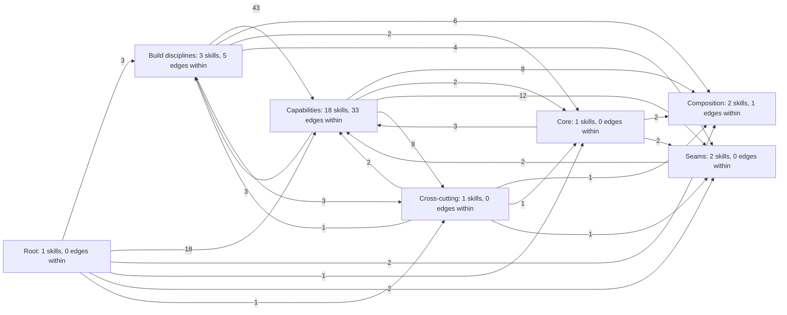
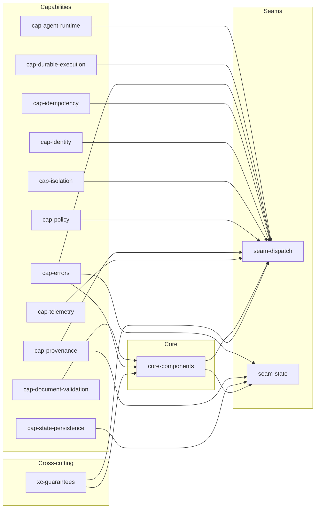
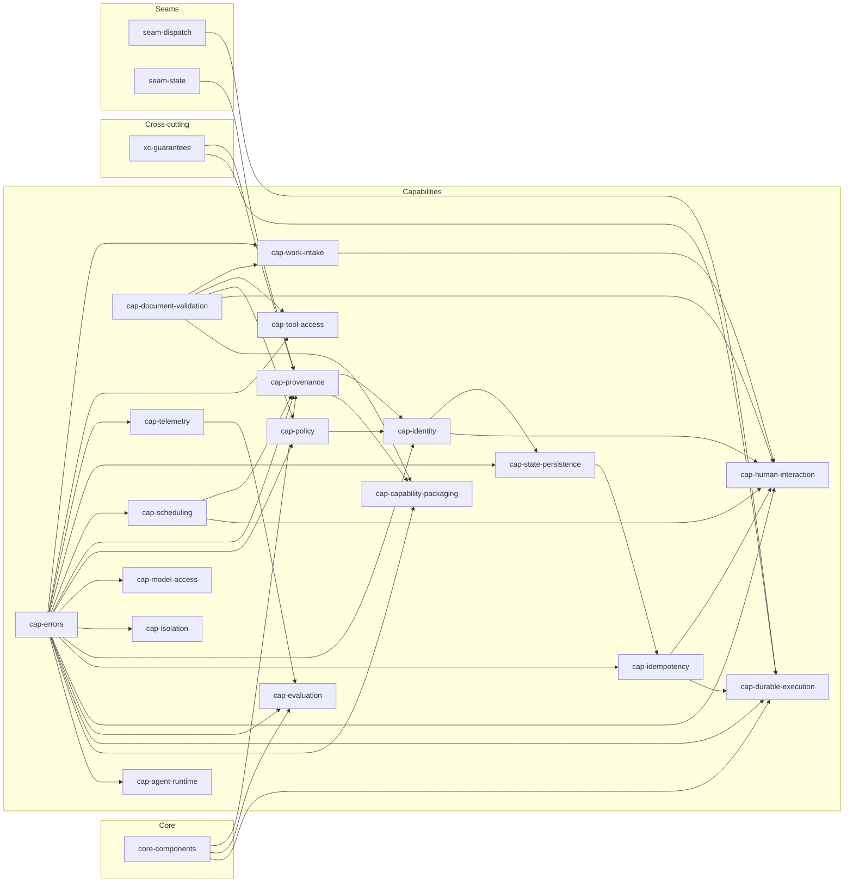
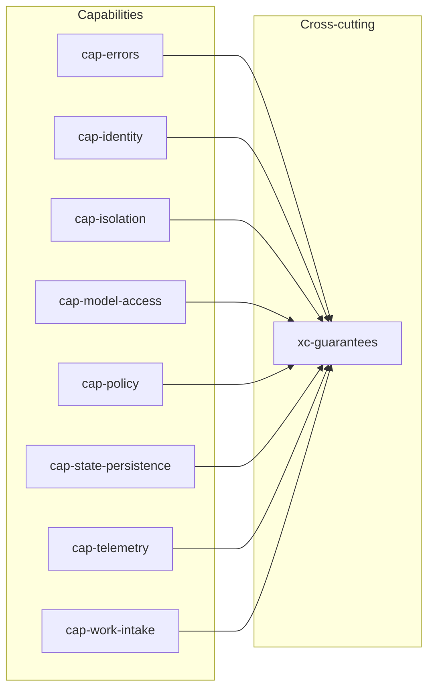
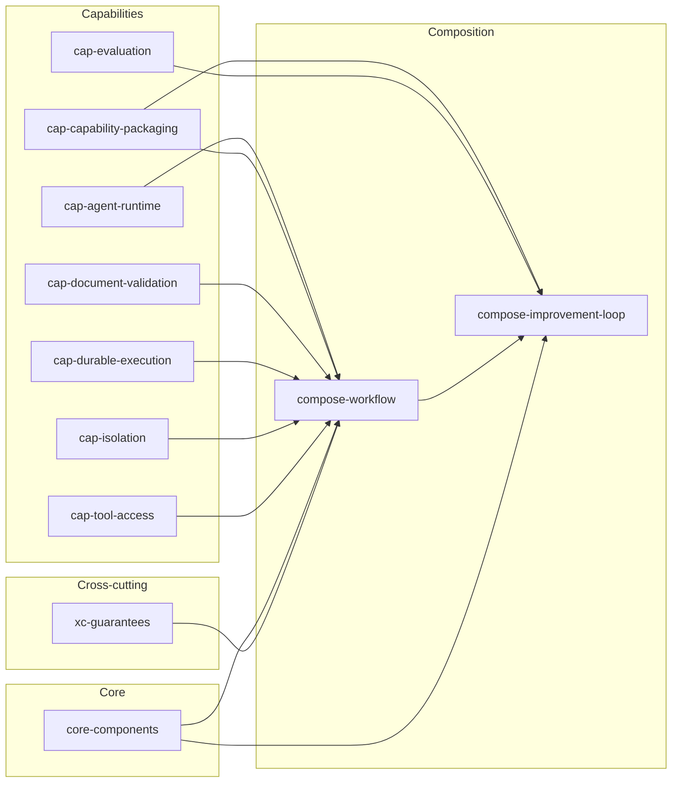
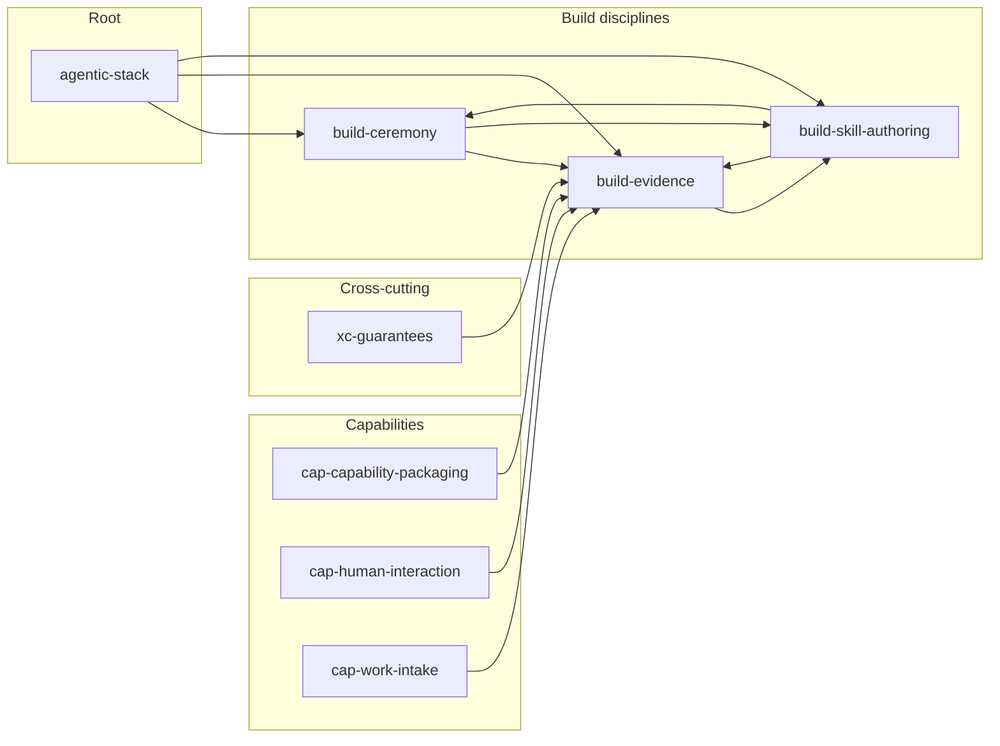
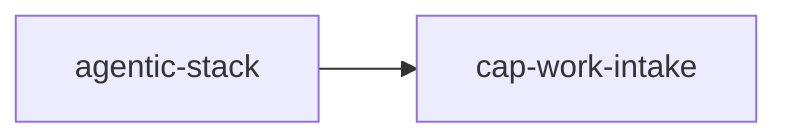
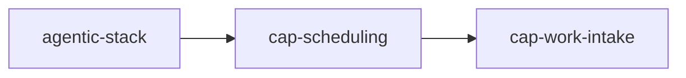

# Skill graph

Generated by `tools/skill_graph.py` from every skill.json. Do not edit by hand.

28 skills, 172 builds_on edges. One diagram of every edge exceeds the mermaid edge budget (500, X-skill-graph-001; text budget 50000 characters, X-skill-graph-002), so the graph is split into focal groups. Each group states its edge count against that budget. Every edge appears in the per-layer tables at the end.

## Overview by layer

Node labels carry the skill count per layer and the edges that stay inside it; edge labels carry how many builds_on edges run from one layer to the other. Build disciplines and the root reach almost every skill, which is why they are kept out of the focal groups below.

25 edges, 932 characters, within the mermaid defaults.

## Core and seams

What the five core components and the two seams build on. An `-implement` facet is folded into its ideal; the build disciplines and the root are omitted here and shown in their own group.

18 edges, 1185 characters, within the mermaid defaults.

## Capabilities

What each capability interface builds on. Same folding and omissions as above.

40 edges, 2314 characters, within the mermaid defaults.

## Cross-cutting concerns

What each cross-cutting concern builds on: the capability it places, and the concerns it chains with.

8 edges, 590 characters, within the mermaid defaults.

## Composition

What each composition assembles. A composition introduces no new interface, so its edges point only downward.

12 edges, 1020 characters, within the mermaid defaults.

## Build disciplines

How the authoring disciplines build on each other and on the root. The table shows how many skills each discipline is applied to; those edges are omitted from every diagram above.

12 edges, 888 characters, within the mermaid defaults.

| Discipline | Applied to |
|---|---|
| `agentic-stack` | 24 skills |
| `build-evidence` | 24 skills |
| `build-skill-authoring` | 24 skills |
| `build-ceremony` | 10 skills |

## Load path per door

The skills a composer loads for each entry door, from `kb/ceremonies/reconcile-01-review-xc.json` (budget 11 per task, TARGET T9.5; the table view is docs/architecture/load-path.md).

### human door: 2 skills, within budget: yes

1 edges, 46 characters, within the mermaid defaults.

### event door: 2 skills, within budget: yes

1 edges, 46 characters, within the mermaid defaults.

### schedule door: 3 skills, within budget: yes

2 edges, 84 characters, within the mermaid defaults.

### external door: 2 skills, within budget: yes

1 edges, 46 characters, within the mermaid defaults.

## Root

| Skill | Builds on | Used by | Purpose |
|---|---|---|---|
| `agentic-stack` | - | `build-ceremony`, `build-evidence`, `build-skill-authoring`, `cap-agent-runtime`, `cap-capability-packaging`, `cap-document-validation`, `cap-durable-execution`, `cap-errors`, `cap-evaluation`, `cap-human-interaction`, `cap-idempotency`, `cap-identity`, `cap-isolation`, `cap-model-access`, `cap-policy`, `cap-provenance`, `cap-scheduling`, `cap-state-persistence`, `cap-telemetry`, `cap-tool-access`, `cap-work-intake`, `compose-improvement-loop`, `compose-workflow`, `core-components`, `seam-dispatch`, `seam-state`, `xc-guarantees` | Root contract for building the agentic platform in PASS.md |

## Core

| Skill | Builds on | Used by | Purpose |
|---|---|---|---|
| `core-components` | `agentic-stack`, `build-evidence`, `build-skill-authoring`, `cap-document-validation`, `cap-errors`, `xc-guarantees` | `cap-durable-execution`, `cap-evaluation`, `cap-provenance`, `compose-improvement-loop`, `compose-workflow`, `seam-dispatch`, `seam-state` | The Document: the one declarable artifact this platform owns - declared intent, a definition of done that is a list of runnable checks with risk tiers, and steps drawn from a closed operator vocabulary - produced in the same shape whether a human, an agent or an event entered, and written before anything reads it |

## Capabilities

| Skill | Builds on | Used by | Purpose |
|---|---|---|---|
| `cap-agent-runtime` | `agentic-stack`, `build-evidence`, `build-skill-authoring`, `cap-errors` | `compose-workflow`, `seam-dispatch` | The ideal state of the Agent runtime capability: one prompt turn with a stop reason as the unit of agent execution, governed by the Agent Client Protocol, with the operations the core imports, the turn shapes, what the boundary refuses to expose, and the criteria that decide whether a candidate runtime may serve the interface |
| `cap-capability-packaging` | `agentic-stack`, `build-ceremony`, `build-evidence`, `build-skill-authoring`, `cap-document-validation`, `cap-errors`, `cap-provenance` | `build-evidence`, `compose-improvement-loop`, `compose-workflow` | The capability-packaging contract: one portable directory shape any conformant runtime can discover, two required resident fields, three load tiers, and the criteria that decide whether a candidate loader or registry may serve |
| `cap-document-validation` | `agentic-stack`, `build-evidence`, `build-skill-authoring` | `cap-capability-packaging`, `cap-human-interaction`, `cap-policy`, `cap-tool-access`, `cap-work-intake`, `compose-workflow`, `core-components` | The document-validation capability: one contract for checking a declared shape against a published schema dialect, JSON Schema 2020-12, with the operations the core imports, the outcome shape, and the criteria that decide whether a candidate validator is good enough |
| `cap-durable-execution` | `agentic-stack`, `build-ceremony`, `build-evidence`, `build-skill-authoring`, `cap-errors`, `cap-idempotency`, `core-components`, `seam-dispatch`, `xc-guarantees` | `compose-workflow`, `seam-dispatch` | The ideal state of the Durable execution capability: a multi-step unit of work survives a crash and resumes at the first incomplete step, expressed as step, idempotency key, checkpoint and resume point and nothing more |
| `cap-errors` | `agentic-stack`, `build-evidence`, `build-skill-authoring` | `cap-agent-runtime`, `cap-capability-packaging`, `cap-durable-execution`, `cap-evaluation`, `cap-human-interaction`, `cap-idempotency`, `cap-identity`, `cap-isolation`, `cap-model-access`, `cap-policy`, `cap-provenance`, `cap-scheduling`, `cap-state-persistence`, `cap-telemetry`, `cap-tool-access`, `cap-work-intake`, `core-components`, `seam-dispatch`, `seam-state`, `xc-guarantees` | The ideal state of the Errors capability: one typed, machine-readable failure object for every boundary in the platform, governed by RFC 9457 problem details and a closed registry of problem types |
| `cap-evaluation` | `agentic-stack`, `build-ceremony`, `build-evidence`, `build-skill-authoring`, `cap-errors`, `cap-telemetry`, `core-components` | `compose-improvement-loop` | The evaluation contract: score a versioned unit of work against a versioned case set - synthetic scenarios and recorded runs replayed with their external effects served from the record - and return passed, failed or inconclusive against a stored baseline |
| `cap-human-interaction` | `agentic-stack`, `build-ceremony`, `build-evidence`, `build-skill-authoring`, `cap-document-validation`, `cap-errors`, `cap-idempotency`, `cap-identity`, `cap-scheduling`, `cap-work-intake` | `build-evidence` | The ideal state of the Human interaction capability: one interface through which a person enters a run, watches it as a typed event stream, and steers it by approving, editing, rejecting or answering back on the same correlation id |
| `cap-idempotency` | `agentic-stack`, `build-evidence`, `build-skill-authoring`, `cap-errors`, `cap-state-persistence` | `cap-durable-execution`, `cap-human-interaction`, `seam-dispatch` | The ideal state of the Idempotency capability: one claim over a key and a payload digest that turns a repeated externally-triggered request into one execution and one answer, governed by the idempotency-key convention and by lease semantics this platform specifies itself |
| `cap-identity` | `agentic-stack`, `build-ceremony`, `build-evidence`, `build-skill-authoring`, `cap-errors`, `cap-policy`, `cap-provenance` | `cap-human-interaction`, `cap-state-persistence`, `seam-dispatch`, `xc-guarantees` | The ideal state of the Identity capability: every action names an actor, delegated agent actors included, and the chain that produced the right to act is explicit rather than reconstructed afterwards |
| `cap-isolation` | `agentic-stack`, `build-evidence`, `build-skill-authoring`, `cap-errors` | `compose-workflow`, `seam-dispatch`, `xc-guarantees` | The ideal state of the Isolation capability: one unit of work runs with declared resources and declared egress, governed by the OCI Runtime Spec, with the operations the core imports, the declaration and containment-report shapes, what the boundary refuses to expose, and the criteria that decide whether a containment technology may serve the interface |
| `cap-model-access` | `agentic-stack`, `build-evidence`, `build-skill-authoring`, `cap-errors` | `xc-guarantees` | The ideal state of the Model access capability: one contract for obtaining a completion from a class of model, with no vendor named by the caller and no way to tell whether the answer came back in a second or overnight |
| `cap-policy` | `agentic-stack`, `build-evidence`, `build-skill-authoring`, `cap-document-validation`, `cap-errors` | `cap-identity`, `seam-dispatch`, `xc-guarantees` | The ideal state of the Policy capability: one decision API that takes a structured request and returns a deterministic allow or deny together with the rule that decided it, before anything is spent |
| `cap-provenance` | `agentic-stack`, `build-ceremony`, `build-evidence`, `build-skill-authoring`, `cap-errors`, `cap-scheduling`, `core-components`, `seam-state`, `xc-guarantees` | `cap-capability-packaging`, `cap-identity`, `seam-dispatch`, `seam-state` | The ideal state of the Provenance capability: a signed statement binding an artifact to the code version, inputs and actor that produced it, in a format a verifier we did not write can check standing alone |
| `cap-scheduling` | `agentic-stack`, `build-evidence`, `build-skill-authoring`, `cap-errors` | `cap-human-interaction`, `cap-provenance` | The ideal state of the Scheduling capability: computing when a recurring unit of work is due as a pure function of one recurrence rule, a time zone and a window, governed by RFC 5545 recurrence rules, with the firing occurrence entering the platform through the same envelope as every other entry |
| `cap-state-persistence` | `agentic-stack`, `build-ceremony`, `build-evidence`, `build-skill-authoring`, `cap-errors`, `cap-identity` | `cap-idempotency`, `seam-state`, `xc-guarantees` | The ideal state of the State persistence capability: put an opaque record somewhere durable, read it back at a pinned snapshot, and hand someone a proof that nothing was changed, without making them hold the whole log |
| `cap-telemetry` | `agentic-stack`, `build-evidence`, `build-skill-authoring`, `cap-errors` | `cap-evaluation`, `seam-dispatch`, `xc-guarantees` | The ideal state of the Telemetry capability: traces and metrics emitted in a form any collector can ingest, with correlation carried on explicit attributes set at dispatch rather than on trace parentage, and with the stable transport half of the interface kept apart from the pre-stable attribute vocabulary |
| `cap-tool-access` | `agentic-stack`, `build-evidence`, `build-skill-authoring`, `cap-document-validation`, `cap-errors` | `compose-workflow` | The ideal state of the Tool access capability: a unit of work reaches tools published by anyone, governed by the Model Context Protocol, with the operations the core imports, the tool-descriptor and call shapes, what the boundary refuses to carry, and the criteria that decide whether a candidate tool server may serve the interface |
| `cap-work-intake` | `agentic-stack`, `build-evidence`, `build-skill-authoring`, `cap-document-validation`, `cap-errors` | `build-evidence`, `cap-human-interaction`, `xc-guarantees` | The ideal state of the Work intake capability: whatever produced a job - a person, an alert, a clock, another agent - it becomes one canonical envelope before anything downstream sees it, governed by the CloudEvents event format and A2A messaging |

## Cross-cutting

| Skill | Builds on | Used by | Purpose |
|---|---|---|---|
| `xc-guarantees` | `agentic-stack`, `build-ceremony`, `build-evidence`, `build-skill-authoring`, `cap-errors`, `cap-identity`, `cap-isolation`, `cap-model-access`, `cap-policy`, `cap-state-persistence`, `cap-telemetry`, `cap-work-intake` | `build-evidence`, `cap-durable-execution`, `cap-provenance`, `compose-workflow`, `core-components`, `seam-dispatch` | One ordered interception chain through which every unit of work passes, whichever way it entered: six typed slots applied in one declared order on the way in and in the inverse order on the way out, at three named points - admission before a work item is accepted, dispatch before a unit runs, and call before each model or tool call |

## Seams

| Skill | Builds on | Used by | Purpose |
|---|---|---|---|
| `seam-dispatch` | `agentic-stack`, `build-evidence`, `build-skill-authoring`, `cap-agent-runtime`, `cap-durable-execution`, `cap-errors`, `cap-idempotency`, `cap-identity`, `cap-isolation`, `cap-policy`, `cap-provenance`, `cap-telemetry`, `core-components`, `xc-guarantees` | `cap-durable-execution` | The Dispatch seam as it should be: one unit of agent work executes under a declared ceiling and returns one typed result whose partial progress is already durable, with the request shape, the result shape, cancellation, ceiling enforcement, partial results, the context a unit receives and folds back, and what a failure returns |
| `seam-state` | `agentic-stack`, `build-evidence`, `build-skill-authoring`, `cap-errors`, `cap-provenance`, `cap-state-persistence`, `core-components` | `cap-provenance` | The State seam: the graph and the ledger as two projections of one append-only, tamper-evident log, written by one writer per run and read at a pinned snapshot |

## Composition

| Skill | Builds on | Used by | Purpose |
|---|---|---|---|
| `compose-improvement-loop` | `agentic-stack`, `build-ceremony`, `build-evidence`, `build-skill-authoring`, `cap-capability-packaging`, `cap-evaluation`, `compose-workflow`, `core-components` | - | The self-improvement loop as a composition: build-ceremony's review and improve steps that close a section seed candidate revisions of the producing skill, the author brief, or a discipline; a bounded compose-loop instance retries one candidate against cap-evaluation's gate until it passes or hits a ceiling; a passing candidate is promoted through cap-capability-registry with a rollback state, never edited into a running skill |
| `compose-workflow` | `agentic-stack`, `build-ceremony`, `build-evidence`, `build-skill-authoring`, `cap-agent-runtime`, `cap-capability-packaging`, `cap-document-validation`, `cap-durable-execution`, `cap-isolation`, `cap-tool-access`, `core-components`, `xc-guarantees` | `compose-improvement-loop` | The closed set of composition operators a caller may write - sequence, parallel with fan-out and tolerate, bounded loop, approval gate, agent call, judge - each with its shape as JSON Schema 2020-12, how they nest because a step is itself a document, and the rule that new capability widens what a field may say and never what syntax a caller must learn |

## Build disciplines

| Skill | Builds on | Used by | Purpose |
|---|---|---|---|
| `build-ceremony` | `agentic-stack`, `build-skill-authoring` | `build-evidence`, `build-skill-authoring`, `cap-capability-packaging`, `cap-durable-execution`, `cap-evaluation`, `cap-human-interaction`, `cap-identity`, `cap-provenance`, `cap-state-persistence`, `compose-improvement-loop`, `compose-workflow`, `xc-guarantees` | The discipline of closing a section with a ceremony: a review record of findings against what the section produced, then an improve record that marks every finding applied or declined with the files it touched, then continuing |
| `build-evidence` | `agentic-stack`, `build-ceremony`, `build-skill-authoring`, `cap-capability-packaging`, `cap-human-interaction`, `cap-work-intake`, `xc-guarantees` | `build-skill-authoring`, `cap-agent-runtime`, `cap-capability-packaging`, `cap-document-validation`, `cap-durable-execution`, `cap-errors`, `cap-evaluation`, `cap-human-interaction`, `cap-idempotency`, `cap-identity`, `cap-isolation`, `cap-model-access`, `cap-policy`, `cap-provenance`, `cap-scheduling`, `cap-state-persistence`, `cap-telemetry`, `cap-tool-access`, `cap-work-intake`, `compose-improvement-loop`, `compose-workflow`, `core-components`, `seam-dispatch`, `seam-state`, `xc-guarantees` | The discipline that gives every piece a machine-checkable criterion, a deliberate breakage that makes that criterion fail, and the recorded output of both runs |
| `build-skill-authoring` | `agentic-stack`, `build-ceremony`, `build-evidence` | `build-ceremony`, `build-evidence`, `cap-agent-runtime`, `cap-capability-packaging`, `cap-document-validation`, `cap-durable-execution`, `cap-errors`, `cap-evaluation`, `cap-human-interaction`, `cap-idempotency`, `cap-identity`, `cap-isolation`, `cap-model-access`, `cap-policy`, `cap-provenance`, `cap-scheduling`, `cap-state-persistence`, `cap-telemetry`, `cap-tool-access`, `cap-work-intake`, `compose-improvement-loop`, `compose-workflow`, `core-components`, `seam-dispatch`, `seam-state`, `xc-guarantees` | How to author a skill in this repository as data rather than prose: a skill.json conforming to schemas/skill.schema.json, rendered to SKILL.md, with every statement either cited to knowledge-base ids and anchored by a verbatim quote, or marked proposed |

