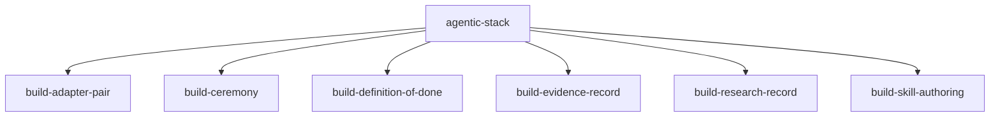

# Skill graph

Generated by `tools/skill_graph.py` from every skill.json. Do not edit by hand.

## Root

| Skill | Builds on | Used by | Purpose |
|---|---|---|---|
| `agentic-stack` | - | - | Root contract for building the agentic platform in PASS.md |

## Build disciplines

| Skill | Builds on | Used by | Purpose |
|---|---|---|---|
| `build-adapter-pair` | `agentic-stack` | - | The discipline of shipping two adapters behind one capability interface, where the second is chosen because it breaks a different assumption than the first |
| `build-ceremony` | `agentic-stack` | - | The discipline of closing a section with a ceremony: a review record of findings against what the section produced, then an improve record that marks every finding applied or declined with the files it touched, then continuing |
| `build-definition-of-done` | `agentic-stack` | - | The discipline that gives every piece a machine-checkable criterion, a deliberate breakage that makes that criterion fail, and the recorded output of both runs |
| `build-evidence-record` | `agentic-stack` | - | The discipline of recording claimed versus measured evidence, so a reader can tell what was observed from what was believed |
| `build-research-record` | `agentic-stack` | - | The discipline of keeping one record per search, source and quote, so a claim a skill makes can be traced back to text that was actually read |
| `build-skill-authoring` | `agentic-stack` | - | How to author a skill in this repository as data rather than prose: a skill.json conforming to schemas/skill.schema.json, rendered to SKILL.md, with every statement either cited to knowledge-base ids and anchored by a verbatim quote, or marked proposed |

