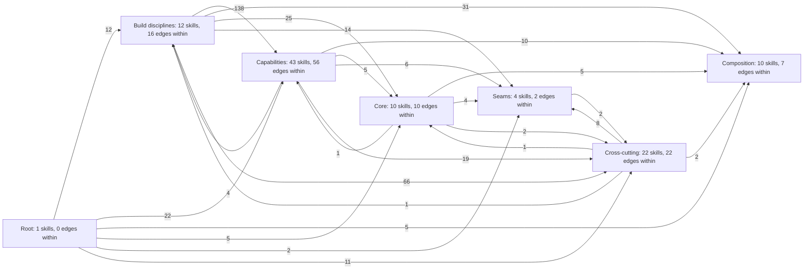
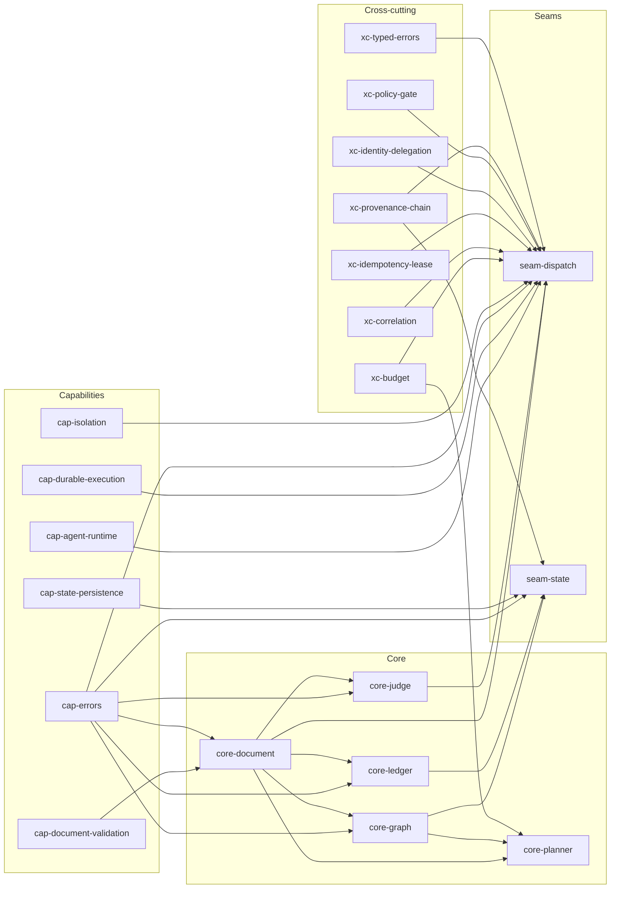
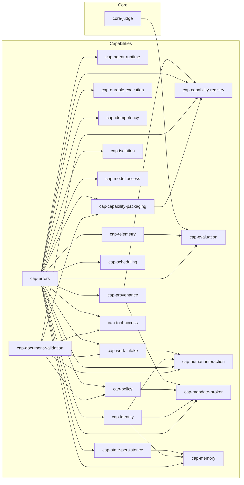
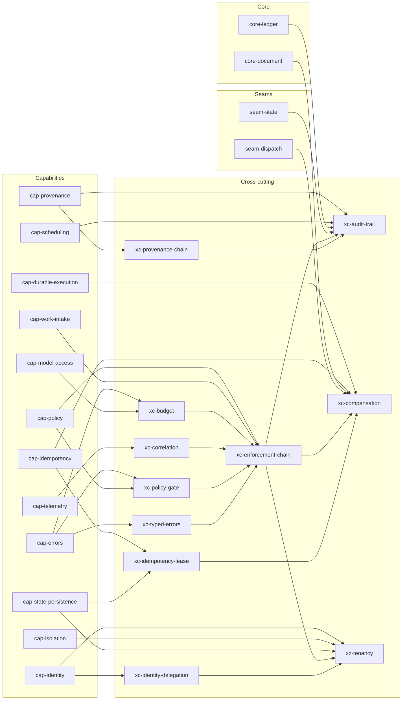
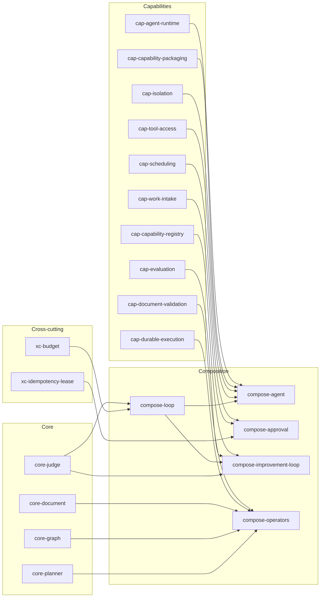
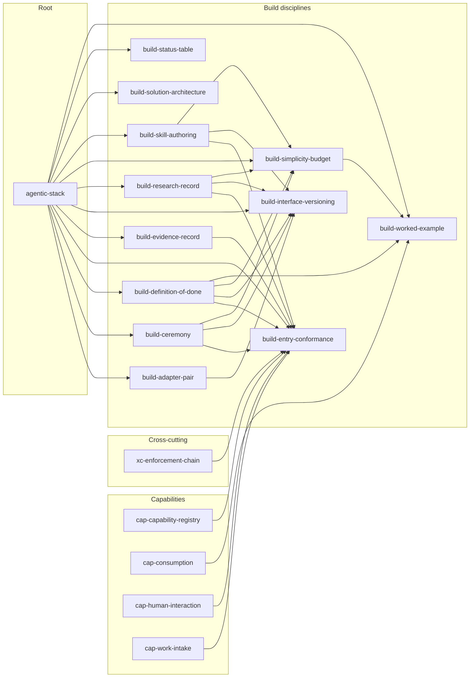
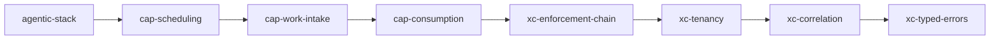

# Skill graph

Generated by `tools/skill_graph.py` from every skill.json. Do not edit by hand.

102 skills, 514 builds_on edges. One diagram of every edge exceeds the mermaid edge budget (500, X-skill-graph-001; text budget 50000 characters, X-skill-graph-002), so the graph is split into focal groups. Each group states its edge count against that budget. Every edge appears in the per-layer tables at the end.

## Overview by layer

Node labels carry the skill count per layer and the edges that stay inside it; edge labels carry how many builds_on edges run from one layer to the other. Build disciplines and the root reach almost every skill, which is why they are kept out of the focal groups below.

25 edges, 947 characters, within the mermaid defaults.

## Core and seams

What the five core components and the two seams build on. An `-implement` facet is folded into its ideal; the build disciplines and the root are omitted here and shown in their own group.

29 edges, 1675 characters, within the mermaid defaults.

## Capabilities

What each capability interface builds on. Same folding and omissions as above.

36 edges, 2081 characters, within the mermaid defaults.

## Cross-cutting concerns

What each cross-cutting concern builds on: the capability it places, and the concerns it chains with.

33 edges, 2115 characters, within the mermaid defaults.

## Composition

What each composition assembles. A composition introduces no new interface, so its edges point only downward.

19 edges, 1491 characters, within the mermaid defaults.

## Build disciplines

How the authoring disciplines build on each other and on the root. The table shows how many skills each discipline is applied to; those edges are omitted from every diagram above.

33 edges, 2352 characters, within the mermaid defaults.

| Discipline | Applied to |
|---|---|
| `build-definition-of-done` | 88 skills |
| `build-adapter-pair` | 67 skills |
| `build-evidence-record` | 53 skills |
| `agentic-stack` | 45 skills |
| `build-skill-authoring` | 44 skills |
| `build-ceremony` | 11 skills |
| `build-research-record` | 11 skills |

## Load path per door

The skills a composer loads for each entry door, from `kb/ceremonies/reconcile-01-review-xc.json` (budget 11 per task, TARGET T9.5; the table view is docs/architecture/load-path.md).

### human door: 7 skills, within budget: yes

6 edges, 244 characters, within the mermaid defaults.

### event door: 7 skills, within budget: yes

6 edges, 244 characters, within the mermaid defaults.

### schedule door: 8 skills, within budget: yes

7 edges, 282 characters, within the mermaid defaults.

### external door: 9 skills, within budget: yes

8 edges, 344 characters, within the mermaid defaults.

## Root

| Skill | Builds on | Used by | Purpose |
|---|---|---|---|
| `agentic-stack` | - | - | Root contract for building the agentic platform in PASS.md |

## Core

| Skill | Builds on | Used by | Purpose |
|---|---|---|---|
| `core-document` | `agentic-stack`, `build-definition-of-done`, `build-skill-authoring`, `cap-document-validation`, `cap-errors` | `compose-operators`, `core-document-implement`, `core-graph`, `core-judge`, `core-ledger`, `core-planner`, `seam-dispatch`, `xc-compensation` | The Document: the one declarable artifact this platform owns - declared intent, a definition of done that is a list of runnable checks with risk tiers, and steps drawn from a closed operator vocabulary - produced in the same shape whether a human, an agent or an event entered, and written before anything reads it |
| `core-document-implement` | `build-adapter-pair`, `build-definition-of-done`, `build-evidence-record`, `core-document` | - | How to build the Document on this stack: one construction path every way in maps into, the schema resource shipped for the validation interface to check, a content digest that survives a store swap, the store that holds declared work today and a second whose execution model differs, the migration off it, where the cross-cutting concerns are wired so no declarer can decline them, and the round-trip run that decides whether either store may serve |
| `core-graph` | `agentic-stack`, `build-definition-of-done`, `build-skill-authoring`, `cap-errors`, `core-document` | `compose-operators`, `core-graph-implement`, `core-planner`, `seam-state` | The Graph: typed nodes and three typed edge kinds - existence, interface, implementation - whose validity is decidable in memory with no store attached, so that design rule 1 stops being a review convention and becomes a check a machine runs |
| `core-graph-implement` | `build-adapter-pair`, `build-definition-of-done`, `build-evidence-record`, `core-graph` | - | How to build the Graph on this stack: a type checker that links no persistence code, one assertion path every producer maps into, node and edge assertions appended as records and folded into a graph value, the log those records sit in today and a second whose execution model differs, the migration off it, where the cross-cutting concerns are wired so no asserter can decline them, and the conformance run that decides whether either log may serve |
| `core-judge` | `agentic-stack`, `build-definition-of-done`, `build-skill-authoring`, `cap-errors`, `core-document` | `cap-evaluation`, `compose-improvement-loop`, `compose-loop`, `core-judge-implement`, `seam-dispatch` | The Judge: a pure function from a result and a criterion to a verdict, where the criterion is resolved out of band and never travels with the work, and where hiding it is treated as necessary but not sufficient - sampling the criterion set per grading and a periodic held-out audit are part of the contract, not an add-on |
| `core-judge-implement` | `build-adapter-pair`, `build-definition-of-done`, `build-evidence-record`, `core-judge` | - | How to build the Judge on this stack: a verdict function that links no model client and no store, a criterion store the graded unit cannot reach, a derived-seed sampler and a held-out audit, two grading engines behind one binding - a deterministic check gate and a model-graded rubric judge - the migration off the gate that decides done today, where the cross-cutting concerns attach, and the conformance run that decides whether either engine may serve |
| `core-ledger` | `agentic-stack`, `build-definition-of-done`, `build-skill-authoring`, `cap-errors`, `core-document` | `core-ledger-implement`, `seam-state`, `xc-audit-trail` | The Ledger: one append-only record that outlives the run and is the single authority on whether a unit of work was already done |
| `core-ledger-implement` | `build-adapter-pair`, `build-definition-of-done`, `build-evidence-record`, `core-ledger` | - | How to build the Ledger on this stack: an append path that links no store code, one entry constructor every producer maps into, an entry identity computed above the store so two stores agree on it, a deduplication projection rebuilt by folding rather than delegated to a store feature, the record store the entries sit in today and a second whose execution model differs, the migration off it, where the cross-cutting fields are stamped so no writer can decline them, and the conformance run that decides whether either store may serve |
| `core-planner` | `agentic-stack`, `build-definition-of-done`, `build-skill-authoring`, `core-document`, `core-graph`, `xc-budget` | `compose-operators`, `core-planner-implement` | The Planner: the pure function from a declared document to a priced plan, computed at one pinned state head and finished before anything is spent |
| `core-planner-implement` | `build-adapter-pair`, `build-definition-of-done`, `build-evidence-record`, `core-planner` | - | How to build the Planner on this stack: a pricing module that links no client of any metered interface, a loader that pins the head and hands the cost table and quantiles in as values, one plan call every producer maps into, the record store those pinned reads sit in today and a second whose execution model differs, the migration from discovering cost by spending it, where the cross-cutting concerns attach to a plan, and the run that decides whether either store may serve |

## Capabilities

| Skill | Builds on | Used by | Purpose |
|---|---|---|---|
| `cap-agent-runtime` | `agentic-stack`, `build-adapter-pair`, `build-definition-of-done`, `build-skill-authoring`, `cap-errors` | `cap-agent-runtime-implement`, `compose-agent`, `seam-dispatch` | The ideal state of the Agent runtime capability: one prompt turn with a stop reason as the unit of agent execution, governed by the Agent Client Protocol, with the operations the core imports, the turn shapes, what the boundary refuses to expose, and the criteria that decide whether a candidate runtime may serve the interface |
| `cap-agent-runtime-implement` | `build-adapter-pair`, `build-definition-of-done`, `build-evidence-record`, `cap-agent-runtime` | - | How to build the Agent runtime capability on this stack: an interactive adapter over the runtime that already runs, a second adapter that has no session at all, how to migrate execution paths that today share no contract, where the budget, policy, identity, telemetry, provenance and idempotency guarantees attach to a turn, and a definition of done with the breakage that makes it fail |
| `cap-capability-packaging` | `agentic-stack`, `build-adapter-pair`, `build-definition-of-done`, `build-skill-authoring`, `cap-document-validation`, `cap-errors` | `cap-capability-packaging-implement`, `cap-capability-registry`, `compose-agent` | The capability-packaging contract: one portable directory shape any conformant runtime can discover, two required resident fields, three load tiers, and the criteria that decide whether a candidate loader or registry may serve |
| `cap-capability-packaging-implement` | `build-adapter-pair`, `build-definition-of-done`, `build-evidence-record`, `cap-capability-packaging` | - | How to build capability packaging on this stack: the filesystem adapter that runs today, a registry adapter that changes where the bytes come from and what identity means, the migration off directories that are rendered and checked in place, where a package resolution is wired so the platform's guarantees ride on it, and the conformance run that decides whether either source may serve |
| `cap-capability-registry` | `agentic-stack`, `build-adapter-pair`, `build-ceremony`, `build-definition-of-done`, `build-research-record`, `build-skill-authoring`, `cap-capability-packaging`, `cap-document-validation`, `cap-errors`, `cap-provenance` | `build-entry-conformance`, `cap-capability-registry-implement`, `compose-improvement-loop` | The capability-registry contract: one record per capability or agent, resolved by name and a version constraint, signed, digest-matched against the package it names, and never edited in place |
| `cap-capability-registry-implement` | `build-adapter-pair`, `build-definition-of-done`, `build-evidence-record`, `cap-capability-registry` | - | How to build the capability registry on this stack: a signed, append-only index beside the packages that run today, a second store that fetches content-addressed records over a network, the migration from resolving by directory path to resolving by name and version constraint, where a resolution and a publish are wired so the platform's guarantees ride on them, and the run that decides whether either store may serve |
| `cap-consumption` | `agentic-stack` | `build-worked-example` | The one consumption contract every capability of this platform shares, written from the caller's side: the four entries of TARGET T6.2 - a human, an event, a schedule, an external system or agent - arrive through one envelope, you supply a small fixed field set and read back either one result or one problem object, and the guarantees you never asked for are already applied |
| `cap-document-validation` | `agentic-stack`, `build-adapter-pair`, `build-definition-of-done`, `build-skill-authoring` | `cap-capability-packaging`, `cap-capability-registry`, `cap-document-validation-implement`, `cap-human-interaction`, `cap-policy`, `cap-tool-access`, `cap-work-intake`, `compose-operators`, `core-document` | The document-validation capability: one contract for checking a declared shape against a published schema dialect, JSON Schema 2020-12, with the operations the core imports, the outcome shape, and the criteria that decide whether a candidate validator is good enough |
| `cap-document-validation-implement` | `build-adapter-pair`, `build-definition-of-done`, `build-evidence-record`, `cap-document-validation` | - | How to build the document-validation capability on this stack: the adapter that runs today, a second adapter whose execution model differs, the migration off the keyword-subset checks that run now, where validation is wired so no caller can decline it, and the conformance run that decides whether either adapter may serve |
| `cap-durable-execution` | `agentic-stack`, `build-adapter-pair`, `build-definition-of-done`, `build-skill-authoring`, `cap-errors` | `cap-durable-execution-implement`, `compose-operators`, `seam-dispatch`, `xc-compensation` | The ideal state of the Durable execution capability: a multi-step unit of work survives a crash and resumes at the first incomplete step, expressed as step, idempotency key, checkpoint and resume point and nothing more |
| `cap-durable-execution-implement` | `build-adapter-pair`, `build-definition-of-done`, `build-evidence-record`, `cap-durable-execution` | - | How to build the Durable execution capability on this stack: a thin adapter over the external workflow orchestrator that is installed but not listening, a second adapter that has no server at all, how to bring workflows that checkpoint nothing today in front of one interface, where budget, policy, identity, telemetry, provenance and idempotency attach to a step and to a restart, and a definition of done with the crash that makes it fail |
| `cap-errors` | `agentic-stack`, `build-adapter-pair`, `build-definition-of-done`, `build-skill-authoring` | `cap-agent-runtime`, `cap-capability-packaging`, `cap-capability-registry`, `cap-durable-execution`, `cap-errors-implement`, `cap-evaluation`, `cap-human-interaction`, `cap-idempotency`, `cap-identity`, `cap-isolation`, `cap-mandate-broker`, `cap-memory`, `cap-model-access`, `cap-policy`, `cap-provenance`, `cap-scheduling`, `cap-state-persistence`, `cap-telemetry`, `cap-tool-access`, `cap-work-intake`, `core-document`, `core-graph`, `core-judge`, `core-ledger`, `seam-dispatch`, `seam-state`, `xc-budget`, `xc-policy-gate`, `xc-typed-errors` | The ideal state of the Errors capability: one typed, machine-readable failure object for every boundary in the platform, governed by RFC 9457 problem details and a closed registry of problem types |
| `cap-errors-implement` | `build-adapter-pair`, `build-definition-of-done`, `build-evidence-record`, `cap-errors` | - | How to build the Errors capability on this stack: the first adapter, a second one with a different execution model, what to do when there is nothing to migrate from, how the budget, policy, identity, idempotency and correlation guarantees land in a failure body, and a definition of done with the breakage that makes it fail |
| `cap-evaluation` | `agentic-stack`, `build-adapter-pair`, `build-ceremony`, `build-definition-of-done`, `build-evidence-record`, `build-research-record`, `build-skill-authoring`, `cap-errors`, `cap-telemetry`, `core-judge` | `cap-evaluation-implement`, `compose-improvement-loop` | The evaluation contract: score a versioned unit of work against a versioned case set - synthetic scenarios and recorded runs replayed with their external effects served from the record - and return passed, failed or inconclusive against a stored baseline |
| `cap-evaluation-implement` | `build-adapter-pair`, `build-definition-of-done`, `build-evidence-record`, `cap-evaluation` | - | How to build the Evaluation capability on this stack: a scoring adapter over the trace backend that already ingests every run, a second adapter with no collector and no server that replays fixtures from disk, the migration from a deterministic pipeline whose behavioural stages can all skip and still report green, where budget, policy, identity, telemetry, provenance and idempotency attach to an evaluation and to each case, and a definition of done with the regression that makes it fail |
| `cap-human-interaction` | `agentic-stack`, `build-adapter-pair`, `build-ceremony`, `build-definition-of-done`, `build-research-record`, `build-skill-authoring`, `cap-document-validation`, `cap-errors`, `cap-identity`, `cap-work-intake` | `build-entry-conformance`, `cap-human-interaction-implement` | The ideal state of the Human interaction capability: one interface through which a person enters a run, watches it as a typed event stream, and steers it by approving, editing, rejecting or answering back on the same correlation id |
| `cap-human-interaction-implement` | `build-adapter-pair`, `build-definition-of-done`, `build-evidence-record`, `cap-human-interaction` | - | How to build the Human interaction capability on this stack: the durable parked-ask store first, the approval unit that already runs wrapped as the first surface, a streaming browser client as the second surface behind the same interface, the migration between them with the ask and decision shapes held still, the one place identity, correlation, budget and replay are stamped on a pause and on a resume, and a definition of done with the breakage that makes it fail |
| `cap-idempotency` | `agentic-stack`, `build-adapter-pair`, `build-definition-of-done`, `build-skill-authoring`, `cap-errors` | `cap-idempotency-implement`, `xc-compensation`, `xc-idempotency-lease` | The ideal state of the Idempotency capability: one claim over a key and a payload digest that turns a repeated externally-triggered request into one execution and one answer, governed by the idempotency-key convention and by lease semantics this platform specifies itself |
| `cap-idempotency-implement` | `build-adapter-pair`, `build-definition-of-done`, `build-evidence-record`, `cap-idempotency` | - | How to build the Idempotency capability on this stack: what the key on the wire already gives you and what it does not, a first enforcing adapter that folds the append-only log at entry, a second with a different execution model that takes a conditional-write lease before execution, the migration between them, where the claim is wired so no entry can skip it, and a definition of done with the breakage that makes it fail |
| `cap-identity` | `agentic-stack`, `build-adapter-pair`, `build-definition-of-done`, `build-skill-authoring`, `cap-errors` | `cap-human-interaction`, `cap-identity-implement`, `cap-mandate-broker`, `cap-memory`, `xc-identity-delegation`, `xc-tenancy` | The ideal state of the Identity capability: every action names an actor, delegated agent actors included, and the chain that produced the right to act is explicit rather than reconstructed afterwards |
| `cap-identity-implement` | `build-adapter-pair`, `build-definition-of-done`, `build-evidence-record`, `cap-identity` | - | How to build the Identity capability on this stack from a starting point of nothing: a first adapter that issues exchanged tokens at each hop, a second whose execution model is the opposite of it, attesting units from platform facts and verifying against distributed trust material with no authority call per action, the order to migrate in, where issuance and verification are wired so no entry can skip them, and a definition of done with the breakage that makes it fail |
| `cap-isolation` | `agentic-stack`, `build-adapter-pair`, `build-definition-of-done`, `build-skill-authoring`, `cap-errors` | `cap-isolation-implement`, `compose-agent`, `seam-dispatch`, `xc-tenancy` | The ideal state of the Isolation capability: one unit of work runs with declared resources and declared egress, governed by the OCI Runtime Spec, with the operations the core imports, the declaration and containment-report shapes, what the boundary refuses to expose, and the criteria that decide whether a containment technology may serve the interface |
| `cap-isolation-implement` | `build-adapter-pair`, `build-definition-of-done`, `build-evidence-record`, `cap-isolation` | - | How to build the Isolation capability on this stack: today's adapter over the per-agent microVM service that already runs, a second adapter that grants capabilities instead of a machine, how the two existing unit shapes become two profiles behind one declaration, where budget, policy, identity, telemetry and provenance attach around a unit rather than inside it, and a definition of done with the breakage that makes it fail |
| `cap-mandate-broker` | `agentic-stack`, `build-adapter-pair`, `build-ceremony`, `build-definition-of-done`, `build-research-record`, `build-skill-authoring`, `cap-errors`, `cap-identity`, `cap-policy`, `cap-provenance` | `cap-mandate-broker-implement` | The mandate and credential brokering contract: an actor exchanges its identity for a short-lived authority bound to one destination, or for a signed, expiring, scope-limited mandate to take one bounded action, and neither the key nor the token ever reaches the unit of work |
| `cap-mandate-broker-implement` | `build-adapter-pair`, `build-definition-of-done`, `build-evidence-record`, `cap-mandate-broker` | - | How to build mandate and credential brokering on this stack: the host-side broker that already keeps the real key outside the sandbox, a second binding whose authority a non-issuer can verify offline, the migration from a dummy key plus one filtered egress path to a minted handle per destination and a signed mandate per irreversible action, where a mint and a verification are wired so the platform's guarantees ride on them, and the run that decides whether either binding may serve |
| `cap-memory` | `agentic-stack`, `build-adapter-pair`, `build-ceremony`, `build-definition-of-done`, `build-research-record`, `build-skill-authoring`, `cap-errors`, `cap-identity`, `cap-state-persistence` | `cap-memory-implement` | The memory contract: write, retrieve and expire scoped items so a later run can read what earlier runs learned without being handed their whole transcript |
| `cap-memory-implement` | `build-adapter-pair`, `build-definition-of-done`, `build-evidence-record`, `cap-memory` | - | How to build the memory capability on this stack: a ranked store behind a binding record, a second store that answers by exact scope key, the migration from handing a run its predecessor's transcript to writing items it can recall, where a write and a recall are wired so the platform's guarantees ride on them, and the run that decides whether either store may be called done |
| `cap-model-access` | `agentic-stack`, `build-adapter-pair`, `build-definition-of-done`, `build-skill-authoring`, `cap-errors` | `cap-model-access-implement`, `xc-budget` | The ideal state of the Model access capability: one contract for obtaining a completion from a class of model, with no vendor named by the caller and no way to tell whether the answer came back in a second or overnight |
| `cap-model-access-implement` | `build-adapter-pair`, `build-definition-of-done`, `build-evidence-record`, `cap-model-access` | - | How to build the Model access capability on this stack: a thin adapter over the model gateway that already runs on the host, a second adapter that answers hours later with a ticket instead of a result, how to bring the model classes that exist today in front of one interface, where budget, policy, identity, telemetry, provenance and idempotency attach to a submission and again to a claim hours later, and a definition of done with the breakage that makes it fail |
| `cap-policy` | `agentic-stack`, `build-adapter-pair`, `build-definition-of-done`, `build-skill-authoring`, `cap-document-validation`, `cap-errors` | `cap-mandate-broker`, `cap-policy-implement`, `xc-enforcement-chain`, `xc-policy-gate` | The ideal state of the Policy capability: one decision API that takes a structured request and returns a deterministic allow or deny together with the rule that decided it, before anything is spent |
| `cap-policy-implement` | `build-adapter-pair`, `build-definition-of-done`, `build-evidence-record`, `cap-policy` | - | How to build the Policy capability on this stack: what the rule sets that exist today already give you and what they do not, a first enforcing adapter that wraps the engine already provisioned behind one decide call, a second with a different execution model that evaluates in process against a typed entity model, the migration between them, where the call is wired so no path can skip it, and a definition of done with the breakage that makes it fail |
| `cap-provenance` | `agentic-stack`, `build-adapter-pair`, `build-definition-of-done`, `build-evidence-record`, `build-skill-authoring`, `cap-errors` | `cap-capability-registry`, `cap-mandate-broker`, `cap-provenance-implement`, `xc-audit-trail`, `xc-provenance-chain` | The ideal state of the Provenance capability: a signed statement binding an artifact to the code version, inputs and actor that produced it, in a format a verifier we did not write can check standing alone |
| `cap-provenance-implement` | `build-adapter-pair`, `build-definition-of-done`, `build-evidence-record`, `cap-provenance` | - | How to build the Provenance capability on this stack: what the append-only evidence records and the hash-chained store already give you and what they do not, a first adapter that wraps an existing record in a signed envelope with a held key, a second with a different execution model that signs with an ephemeral identity and publishes to a public append-only log, the migration between them, where the attest call is wired so no output can skip it, and a definition of done with the breakage that makes it fail |
| `cap-scheduling` | `agentic-stack`, `build-adapter-pair`, `build-definition-of-done`, `build-skill-authoring`, `cap-errors` | `cap-scheduling-implement`, `compose-approval`, `xc-audit-trail` | The ideal state of the Scheduling capability: computing when a recurring unit of work is due as a pure function of one recurrence rule, a time zone and a window, governed by RFC 5545 recurrence rules, with the firing occurrence entering the platform through the same envelope as every other entry |
| `cap-scheduling-implement` | `build-adapter-pair`, `build-definition-of-done`, `build-evidence-record`, `cap-scheduling` | - | How to build the Scheduling capability on this stack: what today's engine-owned schedules give you and what they cost, a standalone recurrence evaluator that computes occurrences as a pure call and enqueues them, the migration between the two with the declaration held still, where firing is wired so an occurrence cannot bypass identity, correlation, budget or replay safety, and a definition of done with the breakage that makes it fail |
| `cap-state-persistence` | `agentic-stack`, `build-adapter-pair`, `build-definition-of-done`, `build-skill-authoring`, `cap-errors` | `cap-memory`, `cap-state-persistence-implement`, `seam-state`, `xc-idempotency-lease`, `xc-tenancy` | The ideal state of the State persistence capability: put an opaque record somewhere durable, read it back at a pinned snapshot, and hand someone a proof that nothing was changed, without making them hold the whole log |
| `cap-state-persistence-implement` | `build-adapter-pair`, `build-definition-of-done`, `build-evidence-record`, `cap-state-persistence` | - | How to build the State persistence capability on this stack: what the hash-chained line-delimited stores that already run give you and what they cannot give anyone else, a first adapter that adds content-addressed ids, a Merkle tree and sealed heads to the file that exists, a second adapter with a different execution model built from immutable objects under a content address and a compare-and-swap head, the migration between them, where the append path is wired so no writer can bypass it, and a definition of done with the breakage that makes it fail |
| `cap-telemetry` | `agentic-stack`, `build-adapter-pair`, `build-definition-of-done`, `build-skill-authoring`, `cap-errors` | `cap-evaluation`, `cap-telemetry-implement`, `xc-correlation` | The ideal state of the Telemetry capability: traces and metrics emitted in a form any collector can ingest, with correlation carried on explicit attributes set at dispatch rather than on trace parentage, and with the stable transport half of the interface kept apart from the pre-stable attribute vocabulary |
| `cap-telemetry-implement` | `build-adapter-pair`, `build-definition-of-done`, `build-evidence-record`, `cap-telemetry` | - | How to build the Telemetry capability on this stack: what the trace UI and ingestion API already running gives you and what it does not, an emitter bound to the pinned transport half, a separately versioned attribute-mapping adapter behind it, a second backend with a different execution model that understands no model calls at all, the migration order, where the correlation attribute set is injected so no step can skip it, and a definition of done with the breakage that makes it fail |
| `cap-tool-access` | `agentic-stack`, `build-adapter-pair`, `build-definition-of-done`, `build-skill-authoring`, `cap-document-validation`, `cap-errors` | `cap-tool-access-implement`, `compose-agent` | The ideal state of the Tool access capability: a unit of work reaches tools published by anyone, governed by the Model Context Protocol, with the operations the core imports, the tool-descriptor and call shapes, what the boundary refuses to carry, and the criteria that decide whether a candidate tool server may serve the interface |
| `cap-tool-access-implement` | `build-adapter-pair`, `build-definition-of-done`, `build-evidence-record`, `cap-tool-access` | - | How to build the Tool access capability on this stack: an adapter over the endpoint that already runs, a second adapter that is a catalogue nobody here controls, how to migrate work that reaches its tools by hard-wired code today, where the budget, policy, identity, telemetry, provenance and idempotency guarantees attach to a call, and a definition of done with the breakage that makes it fail |
| `cap-work-intake` | `agentic-stack`, `build-adapter-pair`, `build-definition-of-done`, `build-skill-authoring`, `cap-document-validation`, `cap-errors` | `build-entry-conformance`, `cap-human-interaction`, `cap-work-intake-implement`, `compose-approval`, `xc-enforcement-chain` | The ideal state of the Work intake capability: whatever produced a job - a person, an alert, a clock, another agent - it becomes one canonical envelope before anything downstream sees it, governed by the CloudEvents event format and A2A messaging |
| `cap-work-intake-implement` | `build-adapter-pair`, `build-definition-of-done`, `build-evidence-record`, `cap-work-intake` | - | How to build the Work intake capability on this stack: the repository-event producer that already runs as a deployment role, an agent-message producer as the second implementation behind the same interface, the migration between them with the canonical envelope held still, the one place cross-cutting fields are stamped so no producer can enter without them, and a definition of done with the breakage that makes it fail |

## Cross-cutting

| Skill | Builds on | Used by | Purpose |
|---|---|---|---|
| `xc-audit-trail` | `agentic-stack`, `build-ceremony`, `build-definition-of-done`, `build-evidence-record`, `build-research-record`, `build-skill-authoring`, `cap-provenance`, `cap-scheduling`, `core-ledger`, `seam-state`, `xc-enforcement-chain`, `xc-provenance-chain` | `xc-audit-trail-implement` | The audit trail as a guarantee rather than a habit: every action attributable to an actor and its delegation chain, the whole run reachable by one correlation id, the record chained so interference shows, and kept for a stated period - all of it applied by the platform from records it already writes, never logged by the caller |
| `xc-audit-trail-implement` | `build-adapter-pair`, `build-definition-of-done`, `build-evidence-record`, `xc-audit-trail`, `xc-enforcement-chain` | - | How to build the audit trail on this stack: a first store that is the chained append-only file we already write and check ourselves, a second that puts the record where a party holding none of our credentials can check it, the migration from a tree with no actor, no correlation index, no monitor and no stated retention floor, where identity, correlation, policy, budget, idempotency and typed failures attach to an entry and to a scan, and a definition of done with the wiring fault that makes it fail |
| `xc-budget` | `agentic-stack`, `build-definition-of-done`, `build-skill-authoring`, `cap-errors`, `cap-model-access` | `compose-loop`, `core-planner`, `seam-dispatch`, `xc-budget-implement`, `xc-enforcement-chain` | The budget guarantee as a placement, not a request: every unit of work carries a ceiling that the platform applies outside the unit, and exceeding it terminates that unit rather than the platform |
| `xc-budget-implement` | `build-adapter-pair`, `build-definition-of-done`, `build-evidence-record`, `xc-budget` | - | How to make the budget ceiling real on this stack: today's enforcement bound to the scoped keys the model gateway already carries, a second enforcement point the platform holds itself and draws from before every dispatch, how to migrate from one to both without a window where nothing stops spend, where the ceiling attaches to correlation, provenance, policy and typed failures, and a definition of done with the breakage that makes it fail |
| `xc-compensation` | `agentic-stack`, `build-ceremony`, `build-definition-of-done`, `build-research-record`, `build-skill-authoring`, `cap-durable-execution`, `cap-idempotency`, `core-document`, `seam-dispatch`, `xc-enforcement-chain`, `xc-idempotency-lease` | `xc-compensation-implement` | The unwind guarantee as a placement: before a unit of work commits a side effect, the platform has already recorded how reversible that effect is and, where the class allows one, the compensating action that undoes it, so a failed or cancelled run walks the record backwards instead of leaving half a transaction behind |
| `xc-compensation-implement` | `build-adapter-pair`, `build-definition-of-done`, `build-evidence-record`, `xc-compensation` | - | How to make the compensation guarantee real on this stack, starting from nothing: no register exists today, so this facet proposes the first one - held by the durable-execution engine that PASS.md records as installed and not listening - and a second that keeps the register in the append-only chained log instead, breaking the assumption that a workflow engine is up at all |
| `xc-correlation` | `agentic-stack`, `build-definition-of-done`, `build-evidence-record`, `build-skill-authoring`, `cap-telemetry` | `seam-dispatch`, `xc-correlation-implement`, `xc-enforcement-chain` | The cross-cutting guarantee that every signal one run emits - every span, every log record, and every problem object - carries the run identifier and the root dispatch identifier the platform stamped at entry, so a run is reassembled by grouping on a field rather than by walking a trace tree |
| `xc-correlation-implement` | `build-adapter-pair`, `build-definition-of-done`, `build-evidence-record`, `xc-correlation` | - | How to build the correlation guarantee on the stack that actually runs: what stamps the run and root dispatch identifiers today, why the header currently injected into the agent runtime is the counter-example rather than the mechanism, the migration in three steps that can each ship alone, the second adapter that moves enforcement out of the emitter's process, and the definition of done that fails when a sub-agent stops re-stamping |
| `xc-enforcement-chain` | `agentic-stack`, `build-ceremony`, `build-definition-of-done`, `build-research-record`, `build-skill-authoring`, `cap-policy`, `cap-work-intake`, `xc-budget`, `xc-correlation`, `xc-policy-gate`, `xc-typed-errors` | `build-entry-conformance`, `xc-audit-trail`, `xc-audit-trail-implement`, `xc-compensation`, `xc-enforcement-chain-implement`, `xc-tenancy` | One ordered interception chain through which every unit of work passes, whichever way it entered: six typed slots applied in one declared order on the way in and in the inverse order on the way out, at three named points - admission before a work item is accepted, dispatch before a unit runs, and call before each model or tool call |
| `xc-enforcement-chain-implement` | `build-adapter-pair`, `build-definition-of-done`, `build-evidence-record`, `xc-enforcement-chain` | - | How to make the enforcement chain real on this stack: a first implementation that wires the three points already enforcing on this host - the approval unit at admission, the dispatcher at dispatch, the host broker and the gateway's scoped key at the call - into one chain with one shared context, a second implementation that runs out of process and admits nothing it has not seen, the migration off three unrelated checks that share no context, where correlation, provenance, identity and typed refusals attach to a slot, and a definition of done with the breakage that makes it fail |
| `xc-idempotency-lease` | `agentic-stack`, `build-definition-of-done`, `build-skill-authoring`, `cap-idempotency`, `cap-state-persistence` | `compose-approval`, `seam-dispatch`, `xc-compensation`, `xc-idempotency-lease-implement` | The replay guarantee as a placement rather than a convention: every externally-triggered action acquires a keyed lease with an owner and an expiry before any side effect, so a repeat produces one execution and one answer whichever way in it arrived |
| `xc-idempotency-lease-implement` | `build-adapter-pair`, `build-definition-of-done`, `build-evidence-record`, `xc-idempotency-lease` | - | How to make the idempotency lease real on this stack: today's provider, which carries the key on the envelope and into the append-only chained store without ever claiming it, a second provider that takes a keyed compare-and-set with a store-evaluated expiry, the key-derivation rule each one publishes, how to migrate from one to both without a window in which two copies can both execute, where the lease attaches to correlation, identity, provenance and typed failures, and a definition of done with the breakage that makes it fail |
| `xc-identity-delegation` | `agentic-stack`, `build-definition-of-done`, `build-skill-authoring`, `cap-identity` | `seam-dispatch`, `xc-identity-delegation-implement`, `xc-tenancy` | The identity guarantee as a placement, not a request: every action names an actor, the actor and the chain behind it are stamped onto the entry envelope by the driving adapter that received the work, and every chain is acyclic and ends at a root that was attested rather than asserted |
| `xc-identity-delegation-implement` | `build-adapter-pair`, `build-definition-of-done`, `build-evidence-record`, `xc-identity-delegation` | - | How to make the identity binding real on this stack from a starting point of nothing: a first enforcement point inside each driving adapter that stamps the actor and the chain onto the envelope at entry, a second that moves the same decision out of process behind an external issuer, how to migrate when no field exists to migrate from, where the chain attaches to correlation, provenance, policy, state and typed failures, and a definition of done with the breakage that makes it fail |
| `xc-policy-gate` | `agentic-stack`, `build-definition-of-done`, `build-skill-authoring`, `cap-errors`, `cap-policy` | `seam-dispatch`, `xc-enforcement-chain`, `xc-policy-gate-implement` | The policy gate as a placement over the call path: the decision is taken, recorded and returned before the first metered call of a dispatch, and a denied dispatch spends exactly nothing |
| `xc-policy-gate-implement` | `build-adapter-pair`, `build-definition-of-done`, `build-evidence-record`, `xc-policy-gate` | - | How to make the policy gate real on this stack: a first placement that consults the decision service synchronously on the dispatch path, a second placement that authorizes at the boundary every metered call crosses, the adoption path from a decision capability that exists and gates nothing, where correlation, provenance, budget and typed failures attach to an admission, and a definition of done with the breakage that makes it fail |
| `xc-provenance-chain` | `agentic-stack`, `build-definition-of-done`, `build-evidence-record`, `build-skill-authoring`, `cap-provenance` | `seam-dispatch`, `seam-state`, `xc-audit-trail`, `xc-provenance-chain-implement` | The provenance chain as a closure guarantee: every artifact digest a result hands back has a signed statement over exactly that digest, recorded before the result is released, so the orphan count is zero |
| `xc-provenance-chain-implement` | `build-adapter-pair`, `build-definition-of-done`, `build-evidence-record`, `xc-provenance-chain` | - | How to close the provenance chain on this stack: a first enforcement point that binds a statement at release and sweeps for orphans over the append-only records that already exist, a second that moves the refusal out of our process to the store that accepts the result, the migration from a tree where nothing is attested and nothing is counted, where correlation, identity, policy, budget and typed failures attach to a binding, and a definition of done with the breakage that makes it fail |
| `xc-tenancy` | `agentic-stack`, `build-ceremony`, `build-definition-of-done`, `build-research-record`, `build-skill-authoring`, `cap-identity`, `cap-isolation`, `cap-state-persistence`, `xc-enforcement-chain`, `xc-identity-delegation` | `xc-tenancy-implement` | The isolation guarantee applied across principals rather than across runs: every unit of work carries a mandatory principal, bound at the same enforcement-chain slot that already binds its actor, and verified at every shared choke point so that one principal's state, memory, budget, identity and telemetry can never be read, spent or exhausted by another's |
| `xc-tenancy-implement` | `build-adapter-pair`, `build-definition-of-done`, `build-evidence-record`, `xc-tenancy` | - | How to make the mandatory-principal guarantee real on this stack from a starting point where tenancy as such does not exist: today's nearest measured substrate (a per-VM jail, per-group scoped budget keys, a single hash-chained log), a second adapter that stores each principal separately instead of filtering a shared store, the migration when no field exists to migrate from, where the scope attaches to the enforcement chain's slots, and a definition of done with a breakage the build owns |
| `xc-typed-errors` | `agentic-stack`, `build-definition-of-done`, `build-skill-authoring`, `cap-errors` | `seam-dispatch`, `xc-enforcement-chain`, `xc-typed-errors-implement` | The cross-cutting guarantee that no failure anywhere in this platform is discovered by matching strings: every failure-producing site returns one typed problem object drawn from one shared closed registry, whichever way the caller entered, and no caller, adapter or fast path can decline it |
| `xc-typed-errors-implement` | `build-adapter-pair`, `build-definition-of-done`, `build-evidence-record`, `xc-typed-errors` | - | How to build the typed-error guarantee on the stack that actually runs: why there is no incumbent to migrate from, what the first implementation is when the enforcement machinery available today is a check that sits outside the enforcement path, the second implementation that moves the check from build time over the tree to run time over live responses, the three-step migration that can each ship alone, where the budget, policy, identity, correlation and idempotency guarantees land as declared members of a failure body, and the definition of done that fails when a retry heuristic starts reading words again |

## Seams

| Skill | Builds on | Used by | Purpose |
|---|---|---|---|
| `seam-dispatch` | `agentic-stack`, `build-adapter-pair`, `build-definition-of-done`, `build-evidence-record`, `build-skill-authoring`, `cap-agent-runtime`, `cap-durable-execution`, `cap-errors`, `cap-isolation`, `core-document`, `core-judge`, `xc-budget`, `xc-correlation`, `xc-idempotency-lease`, `xc-identity-delegation`, `xc-policy-gate`, `xc-provenance-chain`, `xc-typed-errors` | `seam-dispatch-implement`, `xc-compensation` | The Dispatch seam as it should be: one unit of agent work executes under a declared ceiling and returns one typed result whose partial progress is already durable, with the request shape, the result shape, cancellation, ceiling enforcement, partial results, the context a unit receives and folds back, and what a failure returns |
| `seam-dispatch-implement` | `build-adapter-pair`, `build-definition-of-done`, `build-evidence-record`, `seam-dispatch` | - | How to build the Dispatch seam on this stack: a shim over the per-agent virtualisation unit that runs today, a second dispatcher that has no session at all, how to bring three execution paths that share no contract in front of one interface without rewriting any of them, where the budget, policy, identity, telemetry, provenance and idempotency guarantees attach to a dispatch and to a resume, and a definition of done with the breakage that makes it fail |
| `seam-state` | `agentic-stack`, `build-adapter-pair`, `build-definition-of-done`, `build-evidence-record`, `build-skill-authoring`, `cap-errors`, `cap-state-persistence`, `core-graph`, `core-ledger`, `xc-provenance-chain` | `seam-state-implement`, `xc-audit-trail` | The State seam: the graph and the ledger as two projections of one append-only, tamper-evident log, written by one writer per run and read at a pinned snapshot |
| `seam-state-implement` | `build-adapter-pair`, `build-definition-of-done`, `build-evidence-record`, `seam-state` | - | How to build the State seam on this stack: the hash-chained line-delimited task store that already runs, carried forward in stages into one partitioned log with content-addressed records, a fencing lease, a Merkle tree and sealed heads; a second adapter over an object store whose execution model differs; the migration of graph and ledger writes onto one append path; where correlation, identity, policy, provenance, budget and idempotency attach to an append and to a seal; and a definition of done with the breakage that makes it fail |

## Composition

| Skill | Builds on | Used by | Purpose |
|---|---|---|---|
| `compose-agent` | `agentic-stack`, `build-definition-of-done`, `build-skill-authoring`, `cap-agent-runtime`, `cap-capability-packaging`, `cap-isolation`, `cap-tool-access`, `compose-loop` | `compose-agent-implement` | An agent profile assembled from lower layers: what it is good at and not for, a model class that names a routing prefix and never a vendor, a declared tool surface, input and output shapes, a cost class and a max-concurrency ceiling, run as one isolated turn with the grading criterion absent from everything the unit can read |
| `compose-agent-implement` | `build-adapter-pair`, `build-definition-of-done`, `build-evidence-record`, `compose-agent` | - | How compose-agent is actually wired on this repository's substrate: one microVM per agent running the agent-runtime adapter over the Agent Client Protocol as today's admission, a remote agent protocol server as the second, the three ways today's admission is not yet conformant to compose-agent's contract, where the tool-list, capability-set, criterion-absence and identity-chain checks attach to a unit, and a definition of done whose breakage is in the tool-registration binding rather than in the contract |
| `compose-approval` | `agentic-stack`, `build-definition-of-done`, `build-skill-authoring`, `cap-scheduling`, `cap-work-intake`, `xc-idempotency-lease` | `compose-approval-implement` | How to assemble an approval gate as a composition rather than a screen: a step that stops before an irreversible action, parks on a durable record carrying a named view, a deadline, a stated decider and the wire a decision may arrive over, and resumes exactly once on the run's own correlation id with one of approve, edit, reject or return-with-notes |
| `compose-approval-implement` | `build-adapter-pair`, `build-definition-of-done`, `build-evidence-record`, `compose-approval` | - | How to build the approval gate compose-approval fixes on this stack: the parked-item wire that runs today, a queued decision inbox as the second wire because it breaks the assumption that a decider is looking when the ask arrives, where the gate record and the lease are bound so both wires pass through one resume seam, how to migrate from gates that live inside an orchestrator that is not listening, where correlation, identity, budget, provenance and typed errors attach to a park and to a resume, and a definition of done whose breakage moves one binding |
| `compose-improvement-loop` | `agentic-stack`, `build-ceremony`, `build-definition-of-done`, `build-evidence-record`, `build-research-record`, `build-skill-authoring`, `cap-capability-registry`, `cap-evaluation`, `compose-loop`, `core-judge` | `compose-improvement-loop-implement` | The self-improvement loop as a composition: build-ceremony's review and improve steps that close a section seed candidate revisions of the producing skill, the author brief, or a discipline; a bounded compose-loop instance retries one candidate against cap-evaluation's gate until it passes or hits a ceiling; a passing candidate is promoted through cap-capability-registry with a rollback state, never edited into a running skill |
| `compose-improvement-loop-implement` | `build-adapter-pair`, `build-definition-of-done`, `build-evidence-record`, `compose-improvement-loop` | - | How the self-improvement loop is actually built here: this repository's own ceremony review-and-improve pass as the first executor - a live session that edits the target file in place and commits, a reviewer's judgment standing in for a gate - a second executor whose sole promotion authority is cap-evaluation's passed outcome and whose only write path is cap-capability-registry's publish, with no session attached; the migration between them; where correlation, an idempotency lease and provenance attach to one candidate iteration; and a definition of done run against this repository's own tools/ceremony_check.py |
| `compose-loop` | `agentic-stack`, `build-definition-of-done`, `build-evidence-record`, `build-skill-authoring`, `core-judge`, `xc-budget` | `compose-agent`, `compose-improvement-loop`, `compose-loop-implement` | A bounded loop assembled from lower layers: a body that runs, a verdict that decides, and two ceilings that end it |
| `compose-loop-implement` | `build-adapter-pair`, `build-definition-of-done`, `build-evidence-record`, `compose-loop` | - | How a bounded loop is actually built here: the section loop this repository ran as the first executor, a durable executor with no session as the second, the three ways today's loop is not yet conformant, where the ceiling, the correlation attributes, the lease and the typed refusals attach to an iteration, and a definition of done whose breakage is in the wiring rather than in the contract |
| `compose-operators` | `agentic-stack`, `build-ceremony`, `build-definition-of-done`, `build-research-record`, `build-skill-authoring`, `cap-document-validation`, `cap-durable-execution`, `core-document`, `core-graph`, `core-planner` | `compose-operators-implement` | The closed set of composition operators a caller may write - sequence, parallel with fan-out and tolerate, bounded loop, approval gate, agent call, judge - each with its shape as JSON Schema 2020-12, how they nest because a step is itself a document, and the rule that new capability widens what a field may say and never what syntax a caller must learn |
| `compose-operators-implement` | `build-adapter-pair`, `build-definition-of-done`, `build-evidence-record`, `compose-operators` | - | How the closed operator set is actually built here: the interpreted workflow document that runs today, a second engine that compiles the same document ahead of the run, the migration off an operator set that lives in two places at once, where budget, correlation, actor and idempotency attach to an operator, and a definition of done whose breakage is a drift between the schema and the executor |

## Build disciplines

| Skill | Builds on | Used by | Purpose |
|---|---|---|---|
| `build-adapter-pair` | `agentic-stack` | `build-interface-versioning`, `cap-agent-runtime`, `cap-agent-runtime-implement`, `cap-capability-packaging`, `cap-capability-packaging-implement`, `cap-capability-registry`, `cap-capability-registry-implement`, `cap-document-validation`, `cap-document-validation-implement`, `cap-durable-execution`, `cap-durable-execution-implement`, `cap-errors`, `cap-errors-implement`, `cap-evaluation`, `cap-evaluation-implement`, `cap-human-interaction`, `cap-human-interaction-implement`, `cap-idempotency`, `cap-idempotency-implement`, `cap-identity`, `cap-identity-implement`, `cap-isolation`, `cap-isolation-implement`, `cap-mandate-broker`, `cap-mandate-broker-implement`, `cap-memory`, `cap-memory-implement`, `cap-model-access`, `cap-model-access-implement`, `cap-policy`, `cap-policy-implement`, `cap-provenance`, `cap-provenance-implement`, `cap-scheduling`, `cap-scheduling-implement`, `cap-state-persistence`, `cap-state-persistence-implement`, `cap-telemetry`, `cap-telemetry-implement`, `cap-tool-access`, `cap-tool-access-implement`, `cap-work-intake`, `cap-work-intake-implement`, `compose-agent-implement`, `compose-approval-implement`, `compose-improvement-loop-implement`, `compose-loop-implement`, `compose-operators-implement`, `core-document-implement`, `core-graph-implement`, `core-judge-implement`, `core-ledger-implement`, `core-planner-implement`, `seam-dispatch`, `seam-dispatch-implement`, `seam-state`, `seam-state-implement`, `xc-audit-trail-implement`, `xc-budget-implement`, `xc-compensation-implement`, `xc-correlation-implement`, `xc-enforcement-chain-implement`, `xc-idempotency-lease-implement`, `xc-identity-delegation-implement`, `xc-policy-gate-implement`, `xc-provenance-chain-implement`, `xc-tenancy-implement`, `xc-typed-errors-implement` | The discipline of shipping two adapters behind one capability interface, where the second is chosen because it breaks a different assumption than the first |
| `build-ceremony` | `agentic-stack` | `build-entry-conformance`, `build-interface-versioning`, `build-simplicity-budget`, `cap-capability-registry`, `cap-evaluation`, `cap-human-interaction`, `cap-mandate-broker`, `cap-memory`, `compose-improvement-loop`, `compose-operators`, `xc-audit-trail`, `xc-compensation`, `xc-enforcement-chain`, `xc-tenancy` | The discipline of closing a section with a ceremony: a review record of findings against what the section produced, then an improve record that marks every finding applied or declined with the files it touched, then continuing |
| `build-definition-of-done` | `agentic-stack` | `build-entry-conformance`, `build-interface-versioning`, `build-simplicity-budget`, `build-worked-example`, `cap-agent-runtime`, `cap-agent-runtime-implement`, `cap-capability-packaging`, `cap-capability-packaging-implement`, `cap-capability-registry`, `cap-capability-registry-implement`, `cap-document-validation`, `cap-document-validation-implement`, `cap-durable-execution`, `cap-durable-execution-implement`, `cap-errors`, `cap-errors-implement`, `cap-evaluation`, `cap-evaluation-implement`, `cap-human-interaction`, `cap-human-interaction-implement`, `cap-idempotency`, `cap-idempotency-implement`, `cap-identity`, `cap-identity-implement`, `cap-isolation`, `cap-isolation-implement`, `cap-mandate-broker`, `cap-mandate-broker-implement`, `cap-memory`, `cap-memory-implement`, `cap-model-access`, `cap-model-access-implement`, `cap-policy`, `cap-policy-implement`, `cap-provenance`, `cap-provenance-implement`, `cap-scheduling`, `cap-scheduling-implement`, `cap-state-persistence`, `cap-state-persistence-implement`, `cap-telemetry`, `cap-telemetry-implement`, `cap-tool-access`, `cap-tool-access-implement`, `cap-work-intake`, `cap-work-intake-implement`, `compose-agent`, `compose-agent-implement`, `compose-approval`, `compose-approval-implement`, `compose-improvement-loop`, `compose-improvement-loop-implement`, `compose-loop`, `compose-loop-implement`, `compose-operators`, `compose-operators-implement`, `core-document`, `core-document-implement`, `core-graph`, `core-graph-implement`, `core-judge`, `core-judge-implement`, `core-ledger`, `core-ledger-implement`, `core-planner`, `core-planner-implement`, `seam-dispatch`, `seam-dispatch-implement`, `seam-state`, `seam-state-implement`, `xc-audit-trail`, `xc-audit-trail-implement`, `xc-budget`, `xc-budget-implement`, `xc-compensation`, `xc-compensation-implement`, `xc-correlation`, `xc-correlation-implement`, `xc-enforcement-chain`, `xc-enforcement-chain-implement`, `xc-idempotency-lease`, `xc-idempotency-lease-implement`, `xc-identity-delegation`, `xc-identity-delegation-implement`, `xc-policy-gate`, `xc-policy-gate-implement`, `xc-provenance-chain`, `xc-provenance-chain-implement`, `xc-tenancy`, `xc-tenancy-implement`, `xc-typed-errors`, `xc-typed-errors-implement` | The discipline that gives every piece a machine-checkable criterion, a deliberate breakage that makes that criterion fail, and the recorded output of both runs |
| `build-entry-conformance` | `agentic-stack`, `build-ceremony`, `build-definition-of-done`, `build-evidence-record`, `build-research-record`, `build-skill-authoring`, `cap-capability-registry`, `cap-human-interaction`, `cap-work-intake`, `xc-enforcement-chain` | - | The conformance suite every entry point must pass: one document driven through the human, event, schedule and external doors yields one identical envelope, one identical resolved manifest and the same downstream behaviour, with identity and budget attaching per door |
| `build-evidence-record` | `agentic-stack` | `build-entry-conformance`, `cap-agent-runtime-implement`, `cap-capability-packaging-implement`, `cap-capability-registry-implement`, `cap-document-validation-implement`, `cap-durable-execution-implement`, `cap-errors-implement`, `cap-evaluation`, `cap-evaluation-implement`, `cap-human-interaction-implement`, `cap-idempotency-implement`, `cap-identity-implement`, `cap-isolation-implement`, `cap-mandate-broker-implement`, `cap-memory-implement`, `cap-model-access-implement`, `cap-policy-implement`, `cap-provenance`, `cap-provenance-implement`, `cap-scheduling-implement`, `cap-state-persistence-implement`, `cap-telemetry-implement`, `cap-tool-access-implement`, `cap-work-intake-implement`, `compose-agent-implement`, `compose-approval-implement`, `compose-improvement-loop`, `compose-improvement-loop-implement`, `compose-loop`, `compose-loop-implement`, `compose-operators-implement`, `core-document-implement`, `core-graph-implement`, `core-judge-implement`, `core-ledger-implement`, `core-planner-implement`, `seam-dispatch`, `seam-dispatch-implement`, `seam-state`, `seam-state-implement`, `xc-audit-trail`, `xc-audit-trail-implement`, `xc-budget-implement`, `xc-compensation-implement`, `xc-correlation`, `xc-correlation-implement`, `xc-enforcement-chain-implement`, `xc-idempotency-lease-implement`, `xc-identity-delegation-implement`, `xc-policy-gate-implement`, `xc-provenance-chain`, `xc-provenance-chain-implement`, `xc-tenancy-implement`, `xc-typed-errors-implement` | The discipline of recording claimed versus measured evidence, so a reader can tell what was observed from what was believed |
| `build-interface-versioning` | `agentic-stack`, `build-adapter-pair`, `build-ceremony`, `build-definition-of-done`, `build-research-record`, `build-skill-authoring` | - | The discipline of versioning a capability interface: every call declares the interface version it speaks, an unsupported version is refused on that call rather than agreed once at connect time, a core field set is frozen as never-changing, and every deprecation carries a stated window |
| `build-research-record` | `agentic-stack` | `build-entry-conformance`, `build-interface-versioning`, `build-simplicity-budget`, `cap-capability-registry`, `cap-evaluation`, `cap-human-interaction`, `cap-mandate-broker`, `cap-memory`, `compose-improvement-loop`, `compose-operators`, `xc-audit-trail`, `xc-compensation`, `xc-enforcement-chain`, `xc-tenancy` | The discipline of keeping one record per search, source and quote, so a claim a skill makes can be traced back to text that was actually read |
| `build-simplicity-budget` | `agentic-stack`, `build-ceremony`, `build-definition-of-done`, `build-research-record`, `build-skill-authoring` | `build-worked-example` | Hold every element to a counted simplicity budget: one call or one declaration for the common case, options additive with defaults, and an escape hatch that hands full control back |
| `build-skill-authoring` | `agentic-stack` | `build-entry-conformance`, `build-interface-versioning`, `build-simplicity-budget`, `cap-agent-runtime`, `cap-capability-packaging`, `cap-capability-registry`, `cap-document-validation`, `cap-durable-execution`, `cap-errors`, `cap-evaluation`, `cap-human-interaction`, `cap-idempotency`, `cap-identity`, `cap-isolation`, `cap-mandate-broker`, `cap-memory`, `cap-model-access`, `cap-policy`, `cap-provenance`, `cap-scheduling`, `cap-state-persistence`, `cap-telemetry`, `cap-tool-access`, `cap-work-intake`, `compose-agent`, `compose-approval`, `compose-improvement-loop`, `compose-loop`, `compose-operators`, `core-document`, `core-graph`, `core-judge`, `core-ledger`, `core-planner`, `seam-dispatch`, `seam-state`, `xc-audit-trail`, `xc-budget`, `xc-compensation`, `xc-correlation`, `xc-enforcement-chain`, `xc-idempotency-lease`, `xc-identity-delegation`, `xc-policy-gate`, `xc-provenance-chain`, `xc-tenancy`, `xc-typed-errors` | How to author a skill in this repository as data rather than prose: a skill.json conforming to schemas/skill.schema.json, rendered to SKILL.md, with every statement either cited to knowledge-base ids and anchored by a verbatim quote, or marked proposed |
| `build-solution-architecture` | `agentic-stack` | - | The solution-architecture lens applied before a section is built: one blueprint that lists the standards at play with a version or unverified, enumerates every state type exhaustively before pruning, fills the four-door entry matrix, reads each component through its capability's adapter boundary, maps what a change breaks, is myopia-checked by an independent reviewer, turns everything uncited into a triaged gap with a research query, and counts what a builder must read |
| `build-status-table` | `agentic-stack` | - | How STATUS.md is kept: one heading and one table with five fixed columns, one plain statement per cell, a closed status vocabulary, no dependency language, and a checker that rejects anything else |
| `build-worked-example` | `agentic-stack`, `build-definition-of-done`, `build-simplicity-budget`, `cap-consumption` | - | The discipline of writing a worked example of this platform in use, so every example answers the same six questions, shows one document through all four entries, and is graded by the same six criteria |

