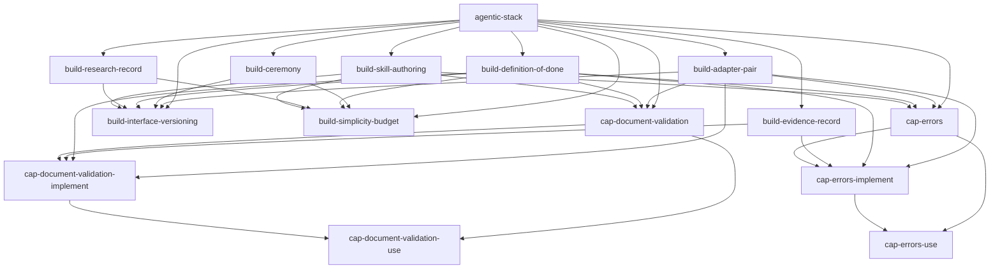

# Skill graph

Generated by `tools/skill_graph.py` from every skill.json. Do not edit by hand.

## Root

| Skill | Builds on | Used by | Purpose |
|---|---|---|---|
| `agentic-stack` | - | - | Root contract for building the agentic platform in PASS.md |

## Capabilities

| Skill | Builds on | Used by | Purpose |
|---|---|---|---|
| `cap-document-validation` | `agentic-stack`, `build-adapter-pair`, `build-definition-of-done`, `build-skill-authoring` | `cap-document-validation-implement`, `cap-document-validation-use` | The document-validation capability: one contract for checking a declared shape against a published schema dialect, JSON Schema 2020-12, with the operations the core imports, the outcome shape, and the criteria that decide whether a candidate validator is good enough |
| `cap-document-validation-implement` | `build-adapter-pair`, `build-definition-of-done`, `build-evidence-record`, `cap-document-validation` | `cap-document-validation-use` | How to build the document-validation capability on this stack: the adapter that runs today, a second adapter whose execution model differs, the migration off the keyword-subset checks that run now, where validation is wired so no caller can decline it, and the conformance run that decides whether either adapter may serve |
| `cap-document-validation-use` | `cap-document-validation`, `cap-document-validation-implement` | - | How to use document validation as a caller: send the document and the name of the shape it claims to be, get back admitted or a located list of everything wrong |
| `cap-errors` | `agentic-stack`, `build-adapter-pair`, `build-definition-of-done`, `build-skill-authoring` | `cap-errors-implement`, `cap-errors-use` | The ideal state of the Errors capability: one typed, machine-readable failure object for every boundary in the platform, governed by RFC 9457 problem details and a closed registry of problem types |
| `cap-errors-implement` | `build-adapter-pair`, `build-definition-of-done`, `build-evidence-record`, `cap-errors` | `cap-errors-use` | How to build the Errors capability on this stack: the first adapter, a second one with a different execution model, what to do when there is nothing to migrate from, how the budget, policy, identity, idempotency and correlation guarantees land in a failure body, and a definition of done with the breakage that makes it fail |
| `cap-errors-use` | `cap-errors`, `cap-errors-implement` | - | How to consume failures from this platform: the three members you actually branch on, what a human, an agent and an event each get back, two worked failures, and why adding a new failure type or swapping the component that produces it does not change code you already wrote |

## Build disciplines

| Skill | Builds on | Used by | Purpose |
|---|---|---|---|
| `build-adapter-pair` | `agentic-stack` | `build-interface-versioning`, `cap-document-validation`, `cap-document-validation-implement`, `cap-errors`, `cap-errors-implement` | The discipline of shipping two adapters behind one capability interface, where the second is chosen because it breaks a different assumption than the first |
| `build-ceremony` | `agentic-stack` | `build-interface-versioning`, `build-simplicity-budget` | The discipline of closing a section with a ceremony: a review record of findings against what the section produced, then an improve record that marks every finding applied or declined with the files it touched, then continuing |
| `build-definition-of-done` | `agentic-stack` | `build-interface-versioning`, `build-simplicity-budget`, `cap-document-validation`, `cap-document-validation-implement`, `cap-errors`, `cap-errors-implement` | The discipline that gives every piece a machine-checkable criterion, a deliberate breakage that makes that criterion fail, and the recorded output of both runs |
| `build-evidence-record` | `agentic-stack` | `cap-document-validation-implement`, `cap-errors-implement` | The discipline of recording claimed versus measured evidence, so a reader can tell what was observed from what was believed |
| `build-interface-versioning` | `agentic-stack`, `build-adapter-pair`, `build-ceremony`, `build-definition-of-done`, `build-research-record`, `build-skill-authoring` | - | The discipline of versioning a capability interface: every call declares the interface version it speaks, an unsupported version is refused on that call rather than agreed once at connect time, a core field set is frozen as never-changing, and every deprecation carries a stated window |
| `build-research-record` | `agentic-stack` | `build-interface-versioning`, `build-simplicity-budget` | The discipline of keeping one record per search, source and quote, so a claim a skill makes can be traced back to text that was actually read |
| `build-simplicity-budget` | `agentic-stack`, `build-ceremony`, `build-definition-of-done`, `build-research-record`, `build-skill-authoring` | - | Hold every element to a counted simplicity budget: one call or one declaration for the common case, options additive with defaults, and an escape hatch that hands full control back |
| `build-skill-authoring` | `agentic-stack` | `build-interface-versioning`, `build-simplicity-budget`, `cap-document-validation`, `cap-errors` | How to author a skill in this repository as data rather than prose: a skill.json conforming to schemas/skill.schema.json, rendered to SKILL.md, with every statement either cited to knowledge-base ids and anchored by a verbatim quote, or marked proposed |

